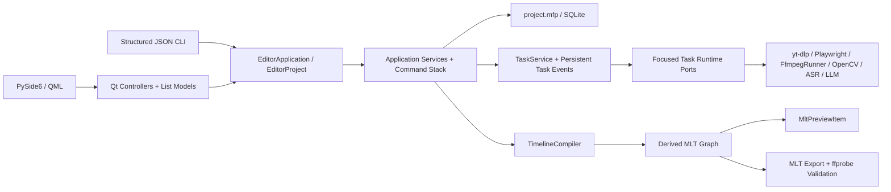

# MediaFlow Pro V2 架构

## 唯一真实边界

每个项目目录中的 `project.mfp` 是项目、素材、序列、轨道、片段、复合片段、转场、字幕、音频图、工作流、任务、任务事件、任务消费、自动化请求和导出设置的唯一持久化来源。当前 schema 版本为 35。34 个历史升级步骤由 `PROJECT_MIGRATIONS` 按源版本唯一登记，`ProjectSchemaMigrator` 只负责在最外层 SQLite 事务中依次执行；任一步没有准确推进到目标版本都会回滚整个升级并释放项目锁。版本 13 至 26 依次收口字幕、时间线转录、可编辑 Web Media、复合片段、视音频轨道配对、词级时间戳、导出历史、命名版本、主体跟踪、源区间识别缓存、结构化任务进度和可复现转录计划。版本 27 增加独立时间线修订号，版本 28 持久化任务事件，版本 29 把任务产物迁移为带项目内/外作用域的类型化引用，版本 30 移除领域项目中的磁盘根路径，版本 31 增加任务幂等键，版本 32 增加自动化请求结果日志，版本 33 持久化类型化任务结果，版本 34 增加跨进程任务执行者、心跳租约、租约到期时间和持久化控制请求，版本 35 增加 `task_consumption`，把任务终态与修订校验、结果副作用和消费日志放进同一个项目事务。MLT XML、分析 JSON、浏览器渲染缓存、代理、波形、SRT、FCPXML 和导出文件都是派生或交付产物，不反向充当编辑状态。

Python 领域模型是唯一合同来源，并按项目、时间线、字幕、音频、导出和高光分模块维护。`EditorApplication` / `EditorProject` 是应用用例的唯一公开组合边界；桌面端和 CLI 只能调用它明确定义的方法，不能取得仓库或具体服务。`ProjectRepository` 只拥有连接、事务和 `catalog`、`timeline`、`audio`、`subtitles`、`highlights`、`web`、`records` 七个显式仓储组件，不保留扁平转发方法。字幕采集、编辑和 SRT 发布使用三个独立服务。工作流服务只处理生命周期和任务组状态；各领域任务处理器属于应用层，只依赖六组窄运行时端口，基础设施按项目组装这些端口。任务完成值只使用 `TaskCompletion`、类型化产物引用和带判别字段的 `TaskOutcome`，不会再靠文件名或临时字典猜测执行结果。

桌面端通过工作区、设置、媒体、时间线、字幕、高光、音频、任务、导出和 Web 十个控制器向 QML 暴露能力。`ProjectSession` 只组装分组状态、模型、单向 `SessionEvents`、投影器和协调器；项目生命周期、后台请求、运行时工具、任务事件及时间线素材操作各自拥有线程、计时器和资源。七个领域投影器把持久化状态投影到列表模型、预览图和派生界面状态，不通过控制器反向广播同一信号。QML 只通过这些控制器和 `QAbstractListModel` 读取状态、发送用户意图，不访问 SQLite、不运行子进程，也不包含编辑约束；CLI 直接复用同一应用边界，并且仍是唯一的 AI 原生自动化入口。

## 运行时边界

- GUI 线程只处理 Qt/QML 状态和 queued signals。
- `FfmpegRunner` 是生产代码构造和启动 FFmpeg 进程的唯一边界，统一命令前缀、进度协议、取消、超时、隐藏窗口和浏览器逐帧输入管道；业务服务只描述媒体参数。FFprobe、MLT melt 和 ASR 可执行程序使用各自边界，不借用 FFmpeg 入口。
- 通用任务在受控线程池中运行；内置 faster-whisper 推理使用 `spawn` 工作进程，Faster-Whisper XXL 使用可取消子进程。两种后端共享同一个静音感知长音频分块器，并按自动资源判断或用户指定的 1–4 个并行块执行。
- 临时运行目录只由当前版本的 `.mediaflow-run.json` 清单和规范 UUID 目录共同声明所有权；缺失、损坏、版本不符或目录身份不符的候选不会被清理。Windows 通过只读进程句柄查询所有者是否仍在运行，不向进程发送探活信号；清理前会再次校验同一清单边界。
- 任务状态和事件在同一个数据库事务中提交。订阅先取得任务快照及对应游标，再接收该游标之后的增量事件，因此桌面进程能观察到 CLI 进程创建的任务，也不会在“快照到订阅”之间漏事件。
- 每个运行中任务都持久化唯一执行者、心跳和有限租约。调度器只能以比较并交换方式领取待执行任务或租约已经到期的任务；活跃租约不会被另一进程接管。暂停和取消写入持久化控制请求，实际执行进程通过心跳和任务进度边界观察请求，因此桌面与 CLI 可以跨进程控制同一任务。
- `TaskService.shutdown` 先停止恢复调度、持久化暂停请求，再等待任务工作线程、心跳线程和处理器拥有的子进程退出；成功返回后才能关闭项目仓库和释放写锁。调用者给出显式超时时，如果仍有工作线程未退出，关闭会失败并保留仓库与写锁，之后可以在同一个 `EditorProject` 上重试关闭。
- 应用不启动常驻控制服务，控制器、任务和界面之间只使用进程内调用与 queued signal。CLI 是短进程、JSON 输入输出的自动化边界；未来若需要 MCP，只允许作为这一边界之上的薄转接层。
- 每个会修改项目的 CLI 请求都带 `request_id`。同步编辑与请求结果日志在同一事务中提交；耗时任务使用同一 `request_id` 派生的任务幂等键，重试只能复用原任务。任务结果的实际应用与 `task_consumption` 在同一个事务中提交，即使任务已经完成而自动化回执尚未来得及写入，重试也只读取第一次消费结果，不会再次修改时间线或生成重复副作用。

## 下载边界

`DownloadPlan` 是 URL 分析的唯一输出，`DownloadEntry` 保存页面地址、实际下载地址、媒体序号、可用状态和显示元数据，`DownloadRequest` 是任务存储与下载处理器之间的唯一命令。首页分析链接时尚未存在项目，因此分析由 `EditorApplication` 在应用级后台线程执行；用户确认画质和保存位置后，控制器用计划中的标题、画面尺寸和帧率创建并打开项目，再把类型化请求提交给项目任务系统。QML 只显示计划和任务进度并提交用户选择，不解析平台 URL；下载器也不重新猜测条目来源。

YouTube 等页面合集在分析阶段使用 yt-dlp 的扁平条目，不提前完整提取每个视频；失效、私密或无权访问的槽位保留在计划中但不可选择。X/Twitter 的当前推文媒体和 `quoted_status` 媒体都由 yt-dlp 提取，同一页面存在多个视频时，每个条目保留原始页面地址和媒体序号，由下载任务交回 yt-dlp 精确选择。B 站合集/分 P 和浏览器监听到的抖音、快手直链也转换为同一计划，不向控制器暴露平台专用结构。

一次提交的多个条目保存为一个下载工作流中的多个 `DownloadRequest`，每项对应一个任务。合集文件统一写入 `<下载目录>/<合集标题>/<序号> <条目标题> [媒体 ID].<扩展名>`；任务完成后仍须经过文件存在性验证和素材注册，界面才能观察到结果。

## 转录边界

`TranscriptionPlan` 是一次时间轴转录的唯一命令内容。用户点击开始时，计划固化序列范围、对白轨、相关片段签名、素材指纹、合并后的源音频区间，以及引擎、模型、设备、语言、断句和并行设置。任务排队或重试时不再重新读取全局 ASR 设置；执行前和写入字幕前都只校验真正影响结果的时间轴内容，波形、缩略图等派生状态不会误伤任务。

时间轴范围先映射为各源素材实际使用的区间，相交区间在加入 0.5 秒识别上下文后合并，再由 FFmpeg 直接生成 16 kHz 单声道输入。识别结果按源区间偏移还原为素材时间，随后通过片段源入点、速度和时间轴位置投影为序列字幕。缓存键包含素材指纹、源区间和影响识别结果的 ASR 配置，不再缓存与复用含义不明的“整份素材结果”。

`AsrPipeline` 对内置 faster-whisper 和 Faster-Whisper XXL 采用同一处理顺序：区间音频准备、超过 15 分钟时的静音检测、约 10 分钟分块、资源受控的并行识别、时间偏移合并。任务进度分别保存当前阶段进度、当前源区间和单调递增的总体识别进度；界面不会再把某个 FFmpeg 或 Whisper 子步骤的 100% 当作整项任务完成。

词级时间保存在 `subtitle_word`，但不再投影为桌面列表模型或人工词卡。转录页只显示任务、结果摘要和进入字幕编辑的入口，因此长转录完成后不会把数千个词对象送入 QML。AI 通过版本化 CLI 的 `transcript.get` 读取源转录，通过 `transcript.edit.preview` 生成绑定项目修订号和摘要的确定性计划，再将原计划交给 `transcript.edit.apply`。词级计划只接受识别器提供的真实词时间；估算词必须改为整段删除。

## 编辑与 MLT

所有时间位置用项目帧整数保存，帧率使用精确分数。素材的 `metadata.duration_frames` 只持久化在主序列帧时钟；进入任意序列的校验、编译、转录或 FCPXML 生成前，统一通过 `timeline_clock` 转换到该序列的精确分数时钟。主序列修改帧率时，同一个事务会重写所有素材时长并使旧代理失效，其他模块不保存第二套素材时长。`TimelineEditor` 是重叠限制、轨道兼容、吸附、成组移动、转场边界、波纹删除、变速和字幕重映射的唯一规则入口。`TimelineDiff` 从编辑前后的占用区间推导波纹调整，统一移动所有未锁定轨道上的后续片段、标记和选区，不再由单个删除命令手写联动规则。`ProjectEditHistory` 是时间线命令和字幕文档编辑共用的唯一会话撤销栈，按真实操作顺序执行撤销/重做；每个命令仍只提交一个数据库事务。

`TimelineEditor` 保留编辑命令和一次性提交，三方合并、波纹删除、通用规则及完整性校验分别由四个策略组件负责。`TimelineCompiler` 只编排编译过程，通用 XML 图、片段生产者、视频、音频和转场分别由五个图组件生成；这条编译链同时服务原生预览、响度分析和最终导出。预览可以选择代理，导出始终解析原片。`editable-media` v3 网页片段只通过 `WebRenderService` 进入媒体管道：它把项目状态和缓存事务交给进程级 `WebCaptureEngine`，后者按帧数、像素量、CPU 上限和可用物理内存复用有界 Chromium worker，通过网页唯一的 `window.__hf.seek(seconds)` 边界并行捕获 `WebClipState` 对应帧，并严格按帧序写入单个 FFmpeg 管道。默认捕获后端是 Chrome CDP 的快速无损透明 PNG；`drawElementImage` 必须在每个 worker 上分别通过截图像素、耗时和生产期验证帧对照，全体一致后才能启用，任一 worker 失效都会终止当前 FFmpeg 进程并从帧 0 用截图后端重建完整缓存。缓存生产者用 FFprobe 验证编码、像素格式、尺寸、帧率和时长，再以文件边缘指纹和原子 manifest 发布；消费者不再用“文件非空”猜测缓存完成状态。网页包导入扫描同时产生全包内容身份和逐文件完整性记录，不重复读取大型媒体。项目写锁与网页缓存写锁统一使用操作系统自动释放的 `ProcessFileLock`，不再依赖超时删除锁文件。MediaFlow 不引入 HyperFrames 运行依赖或第二套网页动画时钟。时间线 QML 根组件只保存视口交互状态，工具栏、画布、轨道控制和六类图层分别渲染。预览画布的缩放、平移和变换手柄只产生编辑意图，最终仍由 `TimelineEditor` 持久化；时间线波形按当前视口换算源素材区间，只读取和绘制可见峰值。C++ 插件只动态加载 MLT C API、取得帧与音频、维护音频主时钟并上传 Qt Scene Graph 纹理；它不知道项目、任务或编辑规则。

AI 转录剪辑、场景检测和主体跟踪都不维护第二套时间线。`TranscriptEditingService` 先用 `TimelineEditor.preview_ripple_delete_intervals` 计算片段和轨道影响，应用时再由同一套纯时间轴变换一次性提交全部区间，同时重建字幕、词时间和 SRT；执行前自动保存命名版本，项目修订号或计划摘要不一致时拒绝执行。场景结果写入 `TimelineMarker`；自动构图和主体跟踪写入 `Clip.transform_keyframes`，再由同一个 `TimelineCompiler` 编译为 MLT 动画。FCPXML 从相同的 `TimelineState`、素材路径、字幕放置和标记生成，不读取预览图或界面模型。绑定视音频用 `asset-clip`，解除绑定后的画面和声音分别用只含一个 `video` 或 `audio` 组件的 `clip`；画面变换、裁切、透明度关键帧和片段音量、声像、淡入淡出转换为标准调整元素。网页片段在交接前由 `WebRenderService` 按各自 `WebClipState` 生成独立 PNG 或 MKV 缓存，资源永远不指向网页入口。当前只交接不带私有参数的标准交叉溶解；其他转场以及非零总线增益、已启用的总线效果没有可靠的标准等价结构，会在创建或覆盖目标文件前拒绝导出并提示改用成片。

`Sequence.in_out` 是预览、时间线显示和导出共同读取的唯一序列范围。智能入出点任务从 `TimelineCompiler` 生成的最终合成画面检测首尾黑屏，并从启用字幕轨道的实际放置区间取得第一句和最后一句对白，加入 0.1 秒保护量后计算建议范围。因此只有音乐、环境声或正常画面而没有对白的首尾仍会被排除。分析结果只有在序列快照未变化时才通过 `TimelineEditor` 写回，并进入同一撤销栈；它不改动片段位置、源入点或源出点。没有启用字幕时只处理黑屏，不凭音量把音乐误判为说话。

## 色彩与音频

- SDR 使用 BT.709；HDR10 使用 10-bit BT.2020/PQ。HDR 工程只暴露经过登记验证的转场。
- HDR 代理保留 Main10/PQ，同时生成 SDR 显示器使用的 tone-mapped 预览代理；导出仍读取原片。
- 音频内部按 48kHz 图处理，轨道只路由到一个上级总线并禁止循环。预览、响度测量和导出编译同一效果链。

## 文件归属与并发

项目内的下载、生成、代理、缓存和导出路径在数据库中保存为项目相对路径；外部导入和用户配置到项目外的下载目录保留绝对引用和指纹。领域对象不保存项目根路径，磁盘定位只存在于基础设施存储上下文。失踪素材不会静默按文件名重连。项目锁保证单写入者，第二实例只能只读打开。最近项目列表只是全局设置中的可重建索引。

MLT 导出把最终视频和所有启用字幕轨道的外部 SRT 视为一个输出集合。渲染前先确定全部最终路径并按规范化路径排序取得跨进程保留，视频与字幕分别写入唯一临时文件并完成探测或内容校验，之后才统一提交。覆盖已有输出时先保留整套旧文件；提交中途失败会撤回已经发布的新文件、恢复全部旧文件，并把失败的新产物移入 `MediaFlow Failed Exports`，不会留下新视频配旧字幕或旧视频配新字幕的半套结果。

同一序列的编辑以 `timeline_revision` 做比较并交换提交。撤销、重做和后台分析都从各自基线做三方合并：只恢复本次操作拥有的字段，保留期间产生的不相干修改；真正冲突时拒绝覆盖并返回明确冲突。任务记录也用 revision 比较并交换保存。外部素材导入、字幕翻译、导出历史、高光序列和转录结果分别使用稳定身份或操作 ID 收口重复副作用。

## 质量边界

领域、应用、基础设施、自动化和组合根全部进入严格 mypy 检查。架构测试固定层级依赖、显式仓储能力、连续迁移链、唯一自动化注册表、FFmpeg 唯一进程入口，以及已拆分上帝文件的尺寸和成员边界。PySide/QML 边界通过真实 Qt 模型、控制器和 QML 冒烟测试验证。CI 对全部非硬件、非外部服务测试运行统一测试集合，不维护容易失真的精选测试名单；原生 MLT、真实 ASR 和在线模型测试使用明确的 integration/slow 标记在具备运行时的环境执行。
