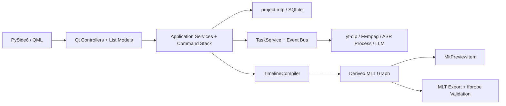

# MediaFlow Pro V2 架构

## 唯一真实边界

每个项目目录中的 `project.mfp` 是项目、素材、序列、轨道、片段、转场、字幕、音频图、工作流、任务引用和导出设置的唯一持久化来源。当前 schema 版本为 5；仓库在一个 SQLite 事务中执行逐版本升级。MLT XML、代理、波形、SRT 和导出文件都是可重建产物，不反向充当编辑状态。

Python 领域模型是唯一合同来源。QML 只通过控制器和 `QAbstractListModel` 读取状态、发送用户意图，不访问 SQLite、不运行子进程，也不包含编辑约束。

## 运行时边界

- GUI 线程只处理 Qt/QML 状态和 queued signals。
- 通用任务在受控线程池中运行；faster-whisper 推理使用 `spawn` 工作进程；FFmpeg、yt-dlp 和 melt 使用可取消子进程。
- `TaskEventBus` 在订阅时先发送完整快照，再发布带 revision 的增量事件。
- 应用不启动本地网络服务、不监听端口，控制器、任务和界面之间只使用进程内调用与 queued signal。

## 编辑与 MLT

所有时间位置用项目帧整数保存，帧率使用精确分数。`TimelineEditor` 是重叠限制、轨道兼容、吸附、转场边界、波纹删除、变速、字幕重映射以及撤销/重做的唯一规则入口。每个命令提交一个事务，撤销栈只存在于当前会话。

`TimelineCompiler` 同时服务原生预览、响度分析和最终导出。预览可以选择代理，导出始终解析原片。C++ 插件只动态加载 MLT C API、取得帧与音频、维护音频主时钟并上传 Qt Scene Graph 纹理；它不知道项目、任务或编辑规则。

## 色彩与音频

- SDR 使用 BT.709；HDR10 使用 10-bit BT.2020/PQ。HDR 工程只暴露经过登记验证的转场。
- HDR 代理保留 Main10/PQ，同时生成 SDR 显示器使用的 tone-mapped 预览代理；导出仍读取原片。
- 音频内部按 48kHz 图处理，轨道只路由到一个上级总线并禁止循环。预览、响度测量和导出编译同一效果链。

## 文件归属与并发

下载、生成、代理、缓存和导出路径在数据库中保存为项目相对路径；外部导入保留绝对引用和指纹。失踪素材不会静默按文件名重连。项目锁保证单写入者，第二实例只能只读打开。最近项目列表只是全局设置中的可重建索引。
