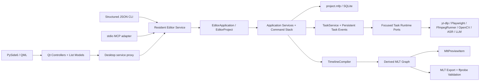

# MediaFlow Pro V2 架构

## 唯一真实边界

每个项目目录中的 `project.mfp` 是项目、素材、序列、轨道、片段、复合片段、转场、字幕、配音方案、音频图、工作流、任务、任务事件、任务消费、自动化请求、协作事件、持久撤销组和导出设置的唯一持久化来源。当前 schema 版本为 47。46 个历史升级步骤由 `PROJECT_MIGRATIONS` 按源版本唯一登记，`ProjectSchemaMigrator` 只负责在最外层 SQLite 事务中依次执行；任一步没有准确推进到目标版本都会回滚整个升级并释放项目锁。版本 13 至 38 依次收口字幕、时间线转录、可编辑 Web Media、复合片段、视音频轨道配对、词级时间戳、导出历史、命名版本、任务幂等与租约、历史 editable-media、素材文件夹和有序视觉效果链。版本 39 增加只追加的 `project_event`，把项目修订、写入路径、操作者、请求回执和操作结果放入同一提交；版本 40 把平台编码器实现迁移为中间策略；版本 41 增加 `undo_group` 和事件逆命令；版本 42 将全部项目、命名版本、任务、事件和快照统一迁移为最终的 `encoder_policy.mode=software|prefer_hardware` 与 `vendor=auto|nvidia|intel|amd|apple`；版本 43 把时间线撤销、重做和命名版本中的整条时间线快照迁移为只包含实际变化实体的双向补丁；版本 44 为持久协作写入开启新的幂等纪元；版本 45 增加原生定格帧和字幕轨样式；版本 46 在写入数据库前预检、转换并用真实 Chromium 验证历史标准网页包，直接发布最终 editable-media v6 包并把旧包归档；版本 47 增加配音方案、说话人、参考音频、说话区间和逐句合成结果，并同步迁移命名版本快照。MLT XML、分析 JSON、浏览器渲染缓存、胶片条、代理、波形、SRT、FCPXML、诊断包和导出文件都是派生或交付产物，不反向充当编辑状态。

产品无关时间线的导入，以及“AI 制作—人工微调—AI 再接手”的顺序交接见 [AI 制作、人工微调与再次交接](docs/ai-human-handoff.md)。

Python 领域模型是唯一合同来源，并按项目、时间线、字幕、音频、导出和高光分模块维护。`EditorApplication` / `EditorProject` 是应用用例的唯一公开组合边界；桌面端和 CLI 只能调用它明确定义的方法，不能取得仓库或具体服务。`ProjectRepository` 只拥有连接和事务，具体能力由 `projects`、`sequences`、`assets`、`timeline`、`audio`、`subtitles`、`highlights`、`web`、`records`、`events`、`history`、`operations`、`observations` 十三个显式组件负责，不保留扁平转发方法。项目元数据、序列目录和素材目录各自拥有独立仓储，旧 `catalog` 仅保留无业务逻辑的导入兼容门面，生产代码不得依赖它。`EditorProject` 只编排公开应用能力；协作回执、事件和持久撤销由 `ProjectCollaboration` 负责，任务结果的原子结算由 `ProjectTaskSettlement` 负责。字幕采集、编辑和 SRT 发布使用三个独立服务。工作流服务只处理生命周期和任务组状态；各领域任务处理器属于应用层，只依赖六组窄运行时端口，基础设施按项目组装这些端口。应用端口按外部能力、项目存储文档、应用服务文档、任务文档和任务运行时分组，`ports.py` 只提供显式稳定出口；领域与应用层不直接读写文件。任务完成值只使用 `TaskCompletion`、类型化产物引用和带判别字段的 `TaskOutcome`，不会再靠文件名或临时字典猜测执行结果。

桌面端只通过 `mediaflow` 根对象按用户职责向 QML 暴露控制器。时间线拆成视图与选择、片段编辑、结构编辑、效果和分析五个控制器；字幕拆成视图与选择、放置、转录、翻译和文本编辑五个控制器；工作区、设置、媒体、高光、音频、任务、导出和 Web 继续各守自己的边界。`ProjectSession` 只组装唯一的 `DesktopSessionState` 状态树、模型、单向 `SessionEvents`、投影器和协调器；设置、项目绑定、选择、任务、资源、下载、后台请求和展示状态不再以平行属性保存。项目生命周期、后台请求、运行时工具、任务事件及时间线素材操作各自拥有线程、计时器和资源。七个领域投影器只从这棵状态树和持久项目读取，再投影到列表模型、预览图和派生界面状态，不通过控制器反向广播同一信号。展示文案按工作区、ASR、消息、导出、任务、翻译、时间线和字幕分模块维护，旧总目录只承担稳定重导出；LLM 提供商预设由版本化资源目录统一提供，QML 不保存模型 ID。设置页只提交单字段意图，类型校验、异步更新合并和延迟持久化由后端 `SettingsDraft` 统一负责。QML 只通过这些控制器和 `QAbstractListModel` 读取状态、发送用户意图，不访问 SQLite、不运行子进程，也不包含编辑约束。桌面、CLI 和 stdio MCP 都是 Editor Service 客户端；服务内的 `EditorApplication` / `EditorProject` 才是唯一可写应用边界。服务会话由项目注册表、自动化操作、桌面操作和运行时操作四个对象组成，不再经过全能会话转发器。桌面项目和时间线调用共同消费不可变的 `DESKTOP_COMMANDS` 类型化注册表；目标、访问级别、撤销能力、调用和变更计划不再由服务、代理和会话各保留一份字符串集合。桌面代理按事件流、远程项目、远程时间线和应用入口拆分，运行时方法仍只从同一命令注册表安装。

## 运行时边界

- GUI 线程只处理 Qt/QML 状态和 queued signals。
- editable-media 应用层没有总服务门面。`WebPackageService` 独占包读取、校验和不可变发布，`WebClipEditingService` 只编排片段编辑命令，完整浏览器快照由 `WebRuntimeStateCommit` 解析为规范状态，所有网页字段约束由 `WebFieldValidator` 校验；`WebBatchService` 独占结构化批量序列，`WebRebindService` 独占全项目换版计划与提交。`WebMediaServices` 只在组合根装配这些对象，不转发业务方法。桌面端同样把浏览器/字段编辑、网页时间线、批量换版与导出分别交给 `WebController`、`WebTimelineController` 和 `WebDeliveryController`，三者只共享不可变的当前选择快照，QML 不再调用旧控制器成员。`Workspace.qml` 只编排工作区，快捷键集中在 `WorkspaceShortcuts.qml`。
- `FfmpegRunner` 是生产代码构造和启动 FFmpeg 进程的唯一边界，统一命令前缀、进度协议、取消、超时、隐藏窗口、浏览器逐帧输入管道和媒体分析输出管道；业务服务只描述媒体参数。`FfprobeRunner` 独立负责 FFprobe 命令，MLT melt 和 ASR 可执行程序继续使用各自边界，不借用 FFmpeg 入口。
- `ReferenceVideoComparisonService` 是项目外参考视频比较的唯一实现。它用 FFprobe 记录两个真实文件的技术身份，用 FFmpeg 输出管道顺序解码指定区间，在有界邻帧窗口内计算逐帧哈希等价、MAE、PSNR 和时间偏移，只保留边界与最差帧图像而不把整段 4K 视频加载进内存。公开 `quality.reference.compare` 操作不读取 `project.mfp`、不修改 editable-media 合同；报告和图像是调用者指定目录中的诊断产物，是否通过只由本次请求的显式阈值决定。
- 通用任务在受控线程池中运行；内置 faster-whisper 推理使用 `spawn` 工作进程，Faster-Whisper XXL 使用可取消子进程。两种后端共享同一个静音感知长音频分块器，并按自动资源判断或用户指定的 1–4 个并行块执行。
- 临时运行目录只由当前版本的 `.mediaflow-run.json` 清单和规范 UUID 目录共同声明所有权；缺失、损坏、版本不符或目录身份不符的候选不会被清理。Windows 通过只读进程句柄查询所有者是否仍在运行，不向进程发送探活信号；清理前会再次校验同一清单边界。
- 任务运行阶段的状态与任务事件在同一个数据库事务中提交。任务完成、失败、取消或暂停时，最终任务状态、类型化结果、任务事件以及成功任务推迟到结算点的项目变化在同一个最外层项目事务中提交；任一正式项目变化失败会使整次结算回滚并由租约恢复重新领取，不会留下“任务已完成、项目尚未更新”的半状态。订阅先取得任务快照及对应游标，再接收该游标之后的增量事件，因此桌面进程能观察到 CLI 进程创建的任务，也不会在“快照到订阅”之间漏事件。
- 每个运行中任务都持久化唯一执行者、心跳和有限租约。调度器只能以比较并交换方式领取待执行任务或租约已经到期的任务；活跃租约不会被另一进程接管。暂停和取消写入持久化控制请求，实际执行进程通过心跳和任务进度边界观察请求，因此桌面与 CLI 可以跨进程控制同一任务。
- `TaskService.shutdown` 先停止恢复调度、持久化暂停请求，再等待任务工作线程、心跳线程和处理器拥有的子进程退出；成功返回后才能关闭项目仓库和释放写锁。调用者给出显式超时时，如果仍有工作线程未退出，关闭会失败并保留仓库与写锁，之后可以在同一个 `EditorProject` 上重试关闭。
- 每个登录用户只有一个按需启动的 Editor Service。它先取得用户级实例锁，再构造应用；每个项目只在服务内打开一个可写 `EditorProject`。发现文件保存 PID、进程创建时间、服务启动时间、回环端口、协议版本和随机令牌，Windows 使用当前用户本地应用目录，macOS 使用 Application Support，Linux 优先使用 `XDG_RUNTIME_DIR`，并在类 Unix 系统限制目录与文件权限。HTTP 只绑定 `127.0.0.1`，JSON-RPC 和 WebSocket 都校验令牌。类 Unix 客户端用新会话启动服务；Windows 客户端通过当前用户的 WMI 进程提供者启动服务并传入当前环境，使它不属于桌面、CLI、MCP 或 IDE 的短期 Job Object。官方 MCP 宿主结束 stdio 进程时不会连带终止驻留服务。
- 桌面项目代理、CLI 和 stdio MCP 不打开 SQLite。CLI 是短进程薄客户端；MCP 只提供 describe、单操作、原子批次、WebSocket 事件跟随和显式桌面工作区命令五个工具。`mediaflow_execute` 的联合输入 schema 在 MCP 生命周期启动时从服务实时 `system.describe` 生成；CLI 与 MCP 都不维护第二套能力表、任务系统或恢复逻辑。
- 每个项目写请求都带 `request_id`、`base_revision`、`actor` 和 `client_id`。服务在冲突判断前查询持久化回执；完全相同的重试返回第一次结果。不相交的过期写入依据连续事件日志自动重放，同一路径冲突返回相关事件。`ProjectMutationPlan` 分开保存用于并发判断的冲突范围和操作允许改变的完整范围；事件变化由命令历史或事务前后的 `ProjectObservation` 真实差异产生，计划路径不能再以占位动作冒充结果。同步编辑与回执、实际变化和项目事件在同一事务中提交；耗时任务使用请求 ID 派生的任务幂等键，终态任务、正式项目变化与 `task_consumption` 在结算事务中原子提交。精确重试复用原任务和已经提交的消费结果，不靠服务启动后的补偿扫描拼接半状态。
- 项目事件提交后经 WebSocket 推送，并支持按持久化游标补发。项目订阅同时接收任务、工作区和结构化冲突事件；不绑定项目的服务订阅接收运行时工具状态与服务停止事件。桌面端忽略自己已经从同步响应投影的事件，外部操作者事件则重新读取项目并更新模型。正在编辑的 UI 字段保留本地草稿；不相交变更直接显示，同字段变更形成待处理冲突，由用户选择保留本地或接受远端。一组原子代理请求共享 `undo_group_id`，撤销历史把它压成一次用户操作。
- 服务命令和后台任务不在等待外部编码、浏览器或分析期间长期占用项目队列。每个项目由一条先进先出、可重入的写命令队列串行提交；`ProjectRepository` 和任务仓储共享服务持有的唯一可写 SQLite 连接，查询使用只读连接。任务处理器只能在准备阶段读取和生成外部产物，正式项目变化统一延迟到结算事务，因此耗时任务运行时仍能接收人工编辑，同时不会产生第二个数据库写入者。
- 桌面进程把所有 `mediaflow.*` 日志写入运行目录的 `logs/mediaflow.log`，使用 5 MiB、5 个备份的 UTF-8 轮转文件。界面操作失败时生成短错误编号，弹窗显示同一编号，日志行保存编号、进程、线程、模块和异常堆栈，用户反馈与开发诊断可以指向同一条记录。
- `AutomationRequestFactory` 从唯一 operation registry 和已验证参数模型生成 canonical `mediaflow-editor` v4 请求；桌面 QML 只发出复制意图，不拼操作名或 JSON。`diagnostics.bundle.create` 通过持久任务生成原子 ZIP，使用 SQLite 一致性备份、真实 runtime/FFprobe/任务/渲染证据和有界日志及失败产物，同时排除原始媒体、cookies、模型、`.env` 与认证信息。

`runtime.lock.json` 按 `windows-x86_64`、`linux-x86_64`、`macos-arm64` 保存系统下限、Qt 工具链、FFmpeg/FFprobe、MLT、Shotcut 归档和 Playwright Chromium 合同。三个目标都使用审核过且带 SHA-256 的精确归档，不读取系统媒体工具、`PATH` 或浏览器安装目录作为后备；原生 QML 插件在各目标 CI runner 上针对锁定的 Qt SDK 现场构建。服务进程创建唯一不可变 `RuntimeContext`，运行时发现只消费当前 `PlatformTarget` 和整套 `MEDIAFLOW_RUNTIME_DIR`；可执行文件后缀、路径大小写、MLT repository/data 和原生插件名称都由合同决定，不把 `.exe`、盘符或 MSVC 目录渗入领域模型。

导出设置不持久化 `h264_nvenc`、`hevc_videotoolbox`、`h264_vaapi` 等机器实现名。项目只保存 `software` 或 `prefer_hardware` 意图，以及 `auto`、`nvidia`、`intel`、`amd`、`apple` 供应商偏好；当前机器在执行时按 Windows 的 NVENC/QSV/AMF、Linux 的 VAAPI/NVENC/QSV、macOS 的 VideoToolbox 解析，偏好模式不可用时明确记录原因并回退软件。MLT 与 Qt 所需进程环境只在启动对应子进程或进入原生 MLT 初始化作用域时设置并恢复，应用构造不会永久改写宿主进程环境。默认字幕样式使用仓库附带的 `LXGW WenKai`，导出进程显式注入字体目录，三平台不依赖同名字体碰巧存在于系统中。

## 下载边界

`DownloadPlan` 是 URL 分析的唯一输出，并明确区分视频与音频；`DownloadEntry` 保存页面地址、实际下载地址、媒体序号、可用状态、显示元数据和平台建议文件名，`DownloadRequest` 是任务存储与下载处理器之间的唯一命令。首页分析链接时尚未存在项目，因此分析由 `EditorApplication` 在应用级后台线程执行；用户确认质量和保存位置后，控制器用计划中的标题、画面尺寸和帧率创建并打开项目，再把类型化请求提交给项目任务系统。QML 只显示计划和任务进度并提交用户选择，不解析平台 URL；下载器也不重新猜测条目来源。

YouTube 等页面合集在分析阶段使用 yt-dlp 的扁平条目，不提前完整提取每个视频；失效、私密或无权访问的槽位保留在计划中但不可选择。X/Twitter 的当前推文媒体和 `quoted_status` 媒体都由 yt-dlp 提取，同一页面存在多个视频时，每个条目保留原始页面地址和媒体序号，由下载任务交回 yt-dlp 精确选择。B 站合集/分 P、浏览器监听到的抖音和快手直链，以及从小宇宙单集页结构化数据或 `og:audio` 得到的音频直链都转换为同一计划，不向控制器暴露平台专用结构；小宇宙计划固定使用音频下载，不覆盖用户保存的视频画质偏好。

一次提交的多个条目保存为一个下载工作流中的多个 `DownloadRequest`，每项对应一个任务。合集文件统一写入 `<下载目录>/<合集标题>/<序号> <条目标题> [媒体 ID].<扩展名>`；任务完成后仍须经过文件存在性验证和素材注册，界面才能观察到结果。

## 转录边界

`TranscriptionPlan` 是一次时间轴转录的唯一命令内容。用户点击开始时，计划固化序列范围、对白轨、相关片段签名、素材指纹、合并后的源音频区间，以及引擎、模型、设备、语言、断句和并行设置。任务排队或重试时不再重新读取全局 ASR 设置；执行前和写入字幕前都只校验真正影响结果的时间轴内容，波形、缩略图等派生状态不会误伤任务。

时间轴范围先映射为各源素材实际使用的区间，相交区间在加入 0.5 秒识别上下文后合并，再由 FFmpeg 直接生成 16 kHz 单声道输入。识别结果按源区间偏移还原为素材时间，随后通过片段源入点、速度和时间轴位置投影为序列字幕。缓存键包含素材指纹、源区间和影响识别结果的 ASR 配置，不再缓存与复用含义不明的“整份素材结果”。

`AsrPipeline` 对内置 faster-whisper 和 Faster-Whisper XXL 采用同一处理顺序：区间音频准备、超过 15 分钟时的静音检测、约 10 分钟分块、资源受控的并行识别、时间偏移合并。任务进度分别保存当前阶段进度、当前源区间和单调递增的总体识别进度；界面不会再把某个 FFmpeg 或 Whisper 子步骤的 100% 当作整项任务完成。

词级时间保存在 `subtitle_word`，但不再投影为桌面列表模型或人工词卡。转录页只显示任务、结果摘要和进入字幕编辑的入口，因此长转录完成后不会把数千个词对象送入 QML。AI 通过版本化 CLI 的 `transcript.get` 读取源转录，通过 `transcript.edit.preview` 生成绑定项目修订号和摘要的确定性计划，再将原计划交给 `transcript.edit.apply`。词级计划只接受识别器提供的真实词时间；估算词必须改为整段删除。

## 编辑与 MLT

所有时间位置用项目帧整数保存，帧率使用精确分数。素材的 `metadata.duration_frames` 只持久化在主序列帧时钟；进入任意序列的校验、编译、转录或 FCPXML 生成前，统一通过 `timeline_clock` 转换到该序列的精确分数时钟。主序列修改帧率时，同一个事务会重写所有素材时长并使旧代理失效，其他模块不保存第二套素材时长。`TimelineEditor` 是重叠限制、轨道兼容、吸附、成组移动、转场边界、波纹删除、变速和字幕重映射的唯一规则入口。`TimelineDiff` 从编辑前后的占用区间推导波纹调整，统一移动所有未锁定轨道上的后续片段、标记和选区，不再由单个删除命令手写联动规则。领域服务内部的 `ProjectEditHistory` 只负责组合一次命令所需的逆操作；跨桌面、CLI、MCP 和服务重启仍有效的用户撤销历史以 `project_event.inverse_command_json` 和 `undo_group` 为唯一真源，撤销和重做本身继续增加项目修订并产生事件。

`TimelineEditor` 只保留编辑命令，`TimelineChangeSession` 独占当前会话快照、完整性校验、三方合并、持久化、帧时钟迁移和本地撤销恢复；波纹删除、通用规则与差异推导继续由独立策略负责。普通片段换源、视觉效果新增/修改/重排/移除同样只从 `TimelineEditor` 进入；换源会重新验证媒体类型和源区间，视觉效果则按片段内稳定 ID 与连续位置保存。`TimelineCompiler` 只编排编译过程，通用 XML 图、片段生产者、视频、音频和转场分别由五个图组件生成；片段生产者按持久化顺序把启用的视觉效果转换为 MLT 滤镜，因此原生预览与最终导出读取同一效果链。预览可以选择代理，导出始终解析原片。

`editable-media` v6 网页片段只通过 `WebRenderService` 进入媒体管道。React 只是生产封闭网页包的方式，MediaFlow 不安装 Node 依赖、不保存 React 状态，也不引入第二条导出管线。media-sources v4 素材账本明确指定 `browser`、`native-underlay` 或 `native-audio`；导入、编辑和换版不从扩展名推断。`WebRenderService` 只编排渲染入口；原生媒体绑定、渲染目标、FFmpeg 命令、浏览器缓存和单片段导出分别由独立组件负责，并共同消费 `WebClipState` 与媒体声明。进程级 `WebCaptureEngine` 把绝对帧分成连续区间，空闲 worker 从最长剩余区间尾部窃取任务；readiness 超时、显式可重试失败或 page 关闭只归还当前帧并替换 page，浏览器池失效则按 generation 原子替换全部 worker 浏览器。完成帧进入有序缓冲区，只有下一个连续帧能写入唯一 FFmpeg 管道。`drawElementImage` 正式捕获失败仍会撤回本次 FFmpeg 输出并从第 0 帧整体切换 screenshot，禁止混合后端缓存。缓存发布前用 FFprobe 验证视音频合同、文件指纹和原子 manifest。MLT 导出同样由 `MltExportService` 编排，探测、编码器选择、导出计划与附属文件各自独立，不在主服务内重复实现媒体判断。

`EditorFieldDescriptor` 是网页、视觉和音频编辑字段的唯一描述，约束、选项来源、默认值与关键帧能力共同驱动领域校验、`mediaflow-cli describe`、动态 `web.clip.edit.describe` 和通用 QML 控件。所有剪切、拆分、变速、反向、冻结、MLT/FCPXML 投影和胶片条共同消费 `timebase` 的三项源时间映射。时间线胶片条按可见区约 78 像素采样并预取一格，视频优先读取代理；网页完整缓存缺失时只捕获请求帧，并复用同一 native media plan 合成底图。胶片条使用 64 MiB 内存 LRU 与 512 MiB 项目磁盘缓存，不写入项目。

网页包导入扫描同时产生全包内容身份和逐文件完整性记录，项目内发布目录保持不可变，换版创建新目录；项目写锁、网页缓存锁和胶片单帧锁统一使用操作系统自动释放的 `ProcessFileLock`。网页时间条拖动只发瞬时浏览器预览，释放后由 `TimelineEditor` 原子持久化一次。QML 时间线只保存视口交互状态，使用后台给出的实际胶片帧，不保存第二份片段状态。源监视器、变换手柄和波形继续通过应用层与 `TimelineEditor` 进入同一时间线真源。

C++ 预览插件把用户播放意图 `playing` 与队列缺帧 `buffering` 分开，并从真实渲染队列公开 `bufferedFrames`。短于 300 ms 的等待不会显示提示；缓冲时播放意图保持，目标帧到达后自动继续，seek、暂停、关闭、重载或错误会独立结束缓冲。插件仍只动态加载 MLT C API，把实时音频输出和顺序视频预解码分成两条消费者链路，通过有界队列向 Qt Scene Graph 纹理供帧，不感知项目、任务或编辑规则。

AI 转录剪辑、场景检测和主体跟踪都不维护第二套时间线。`TranscriptEditingService` 先用 `TimelineEditor.preview_ripple_delete_intervals` 计算片段和轨道影响，应用时再由同一套纯时间轴变换一次性提交全部区间，同时重建字幕、词时间和 SRT；执行前自动保存命名版本，项目修订号或计划摘要不一致时拒绝执行。场景结果写入 `TimelineMarker`；自动构图和主体跟踪写入 `Clip.transform_keyframes`，再由同一个 `TimelineCompiler` 编译为 MLT 动画。FCPXML 从相同的 `TimelineState`、素材路径、字幕放置和标记生成，不读取预览图或界面模型。绑定视音频用 `asset-clip`，解除绑定后的画面和声音分别用只含一个 `video` 或 `audio` 组件的 `clip`；画面变换、裁切、透明度关键帧和片段音量、声像、淡入淡出转换为标准调整元素。网页片段在交接前由 `WebRenderService` 按各自 `WebClipState` 生成独立 PNG 或 MKV 缓存，资源永远不指向网页入口。当前只交接不带私有参数的标准交叉溶解；其他转场以及非零总线增益、已启用的总线效果没有可靠的标准等价结构，会在创建或覆盖目标文件前拒绝导出并提示改用成片。

`Sequence.in_out` 是预览、时间线显示和导出共同读取的唯一序列范围。智能入出点任务从 `TimelineCompiler` 生成的最终合成画面检测首尾黑屏，并从启用字幕轨道的实际放置区间取得第一句和最后一句对白，加入 0.1 秒保护量后计算建议范围。因此只有音乐、环境声或正常画面而没有对白的首尾仍会被排除。分析结果只有在序列快照未变化时才通过 `TimelineEditor` 写回，并进入同一撤销栈；它不改动片段位置、源入点或源出点。没有启用字幕时只处理黑屏，不凭音量把音乐误判为说话。

## 色彩与音频

- SDR 使用 BT.709；HDR10 使用 10-bit BT.2020/PQ。HDR 工程只暴露经过登记验证的转场。
- HDR 代理保留 Main10/PQ，同时生成 SDR 显示器使用的 tone-mapped 预览代理；导出仍读取原片。
- 音频内部按 48kHz 图处理，轨道只路由到一个上级总线并禁止循环。预览、响度测量和导出编译同一效果链。
- 响度结果按序列 ID、完整 MLT 图和源文件实时指纹共同寻址。同一快照的线程与进程通过 `ProcessFileLock` 选出唯一生产者；等待方只在原子发布且版本、序列和快照哈希全部匹配后读取结果。生产者退出会由操作系统释放锁，损坏或旧版本结果不会命中缓存。

## 文件归属与并发

项目内的下载、生成、代理、缓存和导出路径在数据库中保存为项目相对路径；外部导入和用户配置到项目外的下载目录保留绝对引用和指纹。领域对象不保存项目根路径，磁盘定位只存在于基础设施存储上下文。失踪素材不会静默按文件名重连。项目锁保证单写入者，第二实例只能只读打开。最近项目列表只是全局设置中的可重建索引。

素材文件夹和素材的 `bin_id` 属于 `project.mfp`，同级名称按 Unicode 大小写折叠保持唯一；界面上的“全部素材”和“未归档”只是查询范围，不是伪造的项目文件夹。内容时刻也不是第二套索引库：口述时刻直接投影字幕段，画面时刻直接投影高光候选，搜索模型只负责过滤这些真实生产者输出。服务设置和桌面本地设置分别以 schema 1 写入 `service-settings.json` 与 `desktop-settings.json`：项目根、下载、模型、工作流、音频和字幕预设属于服务，窗口、最近项目、工作区布局和导览完成状态属于桌面；类 Unix 系统在原子发布前把这两个文件及包含旧密钥的设置归档限制为 `0600`，Windows 使用当前用户运行目录的 ACL。标准、媒体、竖屏三个布局各自保存面板尺寸与可见性，临时最大化只改变会话布局，不写入项目；应用和服务不读取旧 `settings.json`。

`mediaflow.environment` 负责从被忽略的 `.env` 加载机器配置，进程级变量具有更高优先级；`.env.example` 是公开变量集合，源码、脚本、CI 和文档不得复制机器路径。`storage_paths.default_project_root()` 和 `default_media_root()` 分别只读取 `MEDIAFLOW_PROJECT_ROOT` 与 `MEDIAFLOW_MEDIA_ROOT`，没有盘符回退。桌面端默认创建和公开 `project.create` 都消费同一个工程根；自动化创建只接收安全目录名、显示名称和完整项目 profile，不能提交项目路径，也不存在隐式画布或帧率默认值，并把实际绝对路径作为创建结果返回给后续请求。用户主动从桌面选择其它目录仍属于明确人工操作，不能被自动化推断或沿用。

MLT 导出把最终视频和所有启用字幕轨道的外部 SRT 视为一个输出集合。渲染前先确定全部最终路径并按规范化路径排序取得跨进程保留，视频与字幕分别写入唯一临时文件并完成探测或内容校验，之后才统一提交。覆盖已有输出时先保留整套旧文件；提交中途失败会撤回已经发布的新文件、恢复全部旧文件，并把失败的新产物移入 `MediaFlow Pro Failed Exports`，不会留下新视频配旧字幕或旧视频配新字幕的半套结果。

同一序列的编辑以 `timeline_revision` 做比较并交换提交。撤销、重做和后台分析都从各自基线做三方合并：只恢复本次操作拥有的字段，保留期间产生的不相干修改；真正冲突时拒绝覆盖并返回明确冲突。任务记录也用 revision 比较并交换保存。外部素材导入、字幕翻译、导出历史、高光序列和转录结果分别使用稳定身份或操作 ID 收口重复副作用。

## 质量边界

整个 `mediaflow` 包，包括领域、应用、基础设施、自动化、服务、桌面和组合根，都进入严格 mypy 检查。架构测试固定层级依赖、显式仓储能力、连续迁移链、唯一自动化注册表、FFmpeg 唯一进程入口，以及已拆分上帝文件的尺寸和成员边界；网页媒体总服务不得重新获得业务方法，旧网页控制器成员也不得重新进入 QML。PySide/QML 边界通过真实 Qt 模型、控制器和 QML 冒烟测试验证。`scripts/ci/quality_plan.py` 是 CI 范围的唯一真源：文档与许可证只进入轻量维护链，平台无关代码先经过 Windows 预检并分配到两个确定、无重叠的轻量核心分片；这两个分片不准备 Qt SDK、MLT/FFmpeg 运行时、Chromium 或原生插件。`scripts/ci/test_resources.py` 只登记必须使用桌面、媒体运行时、浏览器或外部进程的测试文件和少量混合文件节点，完整运行再把它们分配到四个运行时分片，不把整个测试库改造成多层 marker 体系。基础设施、桌面、QML、原生运行时、fixture、共享合同、依赖和 quality workflow 变化并行执行 Windows 交互与离线完整链。Ubuntu 24.04 x64 通过 Xvfb/xcb 与 Weston headless 分别加载真实原生 QML 项，macOS runner 必须自证为 arm64；两者都在昂贵的 portable 合同和跨平台交接链之前运行原生预览冒烟。Windows、Linux、macOS 各自产生包含真实媒体、持久事件、撤销历史和附带字体字幕参考片的项目工件，另外两个平台分别重开、撤销、重做、重新链接、编辑、H.264 导出并逐帧对照，共六条迁移链。Python 虚拟环境按操作系统、架构、精确解释器版本和 `requirements.lock` 摘要完整缓存，每个任务只刷新当前源码的 editable 安装并运行 `pip check`；媒体运行时、Qt SDK 和原生源码产物使用独立缓存键。失败任务保留限时诊断产物，不会因运行时缺失而把这些边界降成跳过。需要 API 凭据的完整在线用户链只在仓库变量 `MEDIAFLOW_RUN_ONLINE_E2E=true` 且已配置真实密钥时运行。真实 ASR 模型和其它在线服务仍使用明确的 integration/slow 标记留在具备对应外部资源的环境执行。
