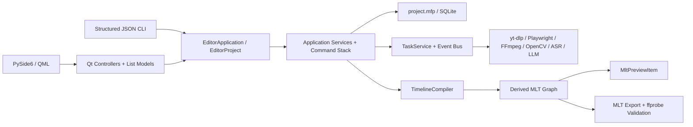

# MediaFlow Pro V2 架构

## 唯一真实边界

每个项目目录中的 `project.mfp` 是项目、素材、序列、轨道、片段、复合片段、转场、字幕、音频图、工作流、任务引用和导出设置的唯一持久化来源。当前 schema 版本为 26；仓库在一个 SQLite 事务中执行逐版本升级。版本 13 至 20 依次收口字幕放置、时间轴转录、可编辑 Web Media、复合片段以及视音频轨道配对；版本 21 保存词级时间戳，版本 22 保存导出质量历史和命名版本目录，版本 23 保存自动构图与主体跟踪关键帧，版本 24 保存源区间识别缓存，版本 25 保存有单位的任务阶段进度，版本 26 将转录范围和 ASR 配置固化为任务计划。MLT XML、分析 JSON、浏览器渲染缓存、代理、波形、SRT、FCPXML 和导出文件都是派生或交付产物，不反向充当编辑状态。

Python 领域模型是唯一合同来源，并按项目、时间线、字幕、音频、导出和高光分模块维护。`EditorApplication` / `EditorProject` 是应用用例的唯一公开组合边界，负责装配项目仓库、编辑服务、工作流和任务处理器。项目仓库只负责连接、事务和共享映射，项目目录、时间线、音频、字幕和高光各自拥有独立仓储能力；字幕采集、编辑和 SRT 发布也使用三个独立服务。工作流服务只处理生命周期和任务组状态，各阶段的任务生产与结果消费由同一个阶段处理器负责。

桌面端通过工作区、设置、媒体、时间线、字幕、高光、音频、任务、导出和 Web 十个控制器向 QML 暴露能力。`ProjectSession` 只协调项目生命周期、任务事件和后台工作，`ProjectPresentationProjector` 负责把持久化状态投影到列表模型、预览图和派生界面状态。QML 只通过这些控制器和 `QAbstractListModel` 读取状态、发送用户意图，不访问 SQLite、不运行子进程，也不包含编辑约束；CLI 直接复用同一应用边界，并且仍是唯一的 AI 原生自动化入口。

## 运行时边界

- GUI 线程只处理 Qt/QML 状态和 queued signals。
- 通用任务在受控线程池中运行；内置 faster-whisper 推理使用 `spawn` 工作进程，Faster-Whisper XXL 使用可取消子进程。两种后端共享同一个静音感知长音频分块器，并按自动资源判断或用户指定的 1–4 个并行块执行。
- `TaskEventBus` 在订阅时先发送完整快照，再发布带 revision 的增量事件。
- 应用不启动常驻控制服务，控制器、任务和界面之间只使用进程内调用与 queued signal。CLI 是短进程、JSON 输入输出的自动化边界；未来若需要 MCP，只允许作为这一边界之上的薄转接层。

## 下载边界

`DownloadPlan` 是 URL 分析的唯一输出，`DownloadEntry` 保存页面地址、实际下载地址、媒体序号、可用状态和显示元数据，`DownloadRequest` 是任务存储与下载处理器之间的唯一命令。首页分析链接时尚未存在项目，因此分析由 `EditorApplication` 在应用级后台线程执行；用户确认画质和保存位置后，控制器用计划中的标题、画面尺寸和帧率创建并打开项目，再把类型化请求提交给项目任务系统。QML 只显示计划和任务进度并提交用户选择，不解析平台 URL；下载器也不重新猜测条目来源。

YouTube 等页面合集在分析阶段使用 yt-dlp 的扁平条目，不提前完整提取每个视频；失效、私密或无权访问的槽位保留在计划中但不可选择。X/Twitter 的当前推文媒体和 `quoted_status` 媒体都由 yt-dlp 提取，同一页面存在多个视频时，每个条目保留原始页面地址和媒体序号，由下载任务交回 yt-dlp 精确选择。B 站合集/分 P 和浏览器监听到的抖音、快手直链也转换为同一计划，不向控制器暴露平台专用结构。

一次提交的多个条目保存为一个下载工作流中的多个 `DownloadRequest`，每项对应一个任务。合集文件统一写入 `<下载目录>/<合集标题>/<序号> <条目标题> [媒体 ID].<扩展名>`；任务完成后仍须经过文件存在性验证和素材注册，界面才能观察到结果。

## 转录边界

`TranscriptionPlan` 是一次时间轴转录的唯一命令内容。用户点击开始时，计划固化序列范围、对白轨、相关片段签名、素材指纹、合并后的源音频区间，以及引擎、模型、设备、语言、断句和并行设置。任务排队或重试时不再重新读取全局 ASR 设置；执行前和写入字幕前都只校验真正影响结果的时间轴内容，波形、缩略图等派生状态不会误伤任务。

时间轴范围先映射为各源素材实际使用的区间，相交区间在加入 0.5 秒识别上下文后合并，再由 FFmpeg 直接生成 16 kHz 单声道输入。识别结果按源区间偏移还原为素材时间，随后通过片段源入点、速度和时间轴位置投影为序列字幕。缓存键包含素材指纹、源区间和影响识别结果的 ASR 配置，不再缓存与复用含义不明的“整份素材结果”。

`AsrPipeline` 对内置 faster-whisper 和 Faster-Whisper XXL 采用同一处理顺序：区间音频准备、超过 15 分钟时的静音检测、约 10 分钟分块、资源受控的并行识别、时间偏移合并。任务进度分别保存当前阶段进度、当前源区间和单调递增的总体识别进度；界面不会再把某个 FFmpeg 或 Whisper 子步骤的 100% 当作整项任务完成。

词级时间保存在 `subtitle_word`，但不再投影为桌面列表模型或人工词卡。转录页只显示任务、结果摘要和进入字幕编辑的入口，因此长转录完成后不会把数千个词对象送入 QML。AI 通过版本化 CLI 的 `transcript.get` 读取源转录，通过 `transcript.edit.preview` 生成绑定项目修订号和摘要的确定性计划，再将原计划交给 `transcript.edit.apply`。词级计划只接受识别器提供的真实词时间；估算词必须改为整段删除。

## 编辑与 MLT

所有时间位置用项目帧整数保存，帧率使用精确分数。`TimelineEditor` 是重叠限制、轨道兼容、吸附、成组移动、转场边界、波纹删除、变速和字幕重映射的唯一规则入口。`TimelineDiff` 从编辑前后的占用区间推导波纹调整，统一移动所有未锁定轨道上的后续片段、标记和选区，不再由单个删除命令手写联动规则。`ProjectEditHistory` 是时间线命令和字幕文档编辑共用的唯一会话撤销栈，按真实操作顺序执行撤销/重做；每个命令仍只提交一个数据库事务。

`TimelineCompiler` 同时服务原生预览、响度分析和最终导出。预览可以选择代理，导出始终解析原片。预览画布的缩放、平移和变换手柄只产生编辑意图，最终仍由 `TimelineEditor` 持久化；时间线波形按当前视口换算源素材区间，只读取和绘制可见峰值。C++ 插件只动态加载 MLT C API、取得帧与音频、维护音频主时钟并上传 Qt Scene Graph 纹理；它不知道项目、任务或编辑规则。

AI 转录剪辑、场景检测和主体跟踪都不维护第二套时间线。`TranscriptEditingService` 先用 `TimelineEditor.preview_ripple_delete_intervals` 计算片段和轨道影响，应用时再由同一套纯时间轴变换一次性提交全部区间，同时重建字幕、词时间和 SRT；执行前自动保存命名版本，项目修订号或计划摘要不一致时拒绝执行。场景结果写入 `TimelineMarker`；自动构图和主体跟踪写入 `Clip.transform_keyframes`，再由同一个 `TimelineCompiler` 编译为 MLT 动画。FCPXML 从相同的 `TimelineState`、素材路径、字幕放置和标记生成，不读取预览图或界面模型。

`Sequence.in_out` 是预览、时间线显示和导出共同读取的唯一序列范围。智能入出点任务从 `TimelineCompiler` 生成的最终合成画面检测首尾黑屏，并从启用字幕轨道的实际放置区间取得第一句和最后一句对白，加入 0.1 秒保护量后计算建议范围。因此只有音乐、环境声或正常画面而没有对白的首尾仍会被排除。分析结果只有在序列快照未变化时才通过 `TimelineEditor` 写回，并进入同一撤销栈；它不改动片段位置、源入点或源出点。没有启用字幕时只处理黑屏，不凭音量把音乐误判为说话。

## 色彩与音频

- SDR 使用 BT.709；HDR10 使用 10-bit BT.2020/PQ。HDR 工程只暴露经过登记验证的转场。
- HDR 代理保留 Main10/PQ，同时生成 SDR 显示器使用的 tone-mapped 预览代理；导出仍读取原片。
- 音频内部按 48kHz 图处理，轨道只路由到一个上级总线并禁止循环。预览、响度测量和导出编译同一效果链。

## 文件归属与并发

项目内的下载、生成、代理、缓存和导出路径在数据库中保存为项目相对路径；外部导入和用户配置到项目外的下载目录保留绝对引用和指纹。失踪素材不会静默按文件名重连。项目锁保证单写入者，第二实例只能只读打开。最近项目列表只是全局设置中的可重建索引。
