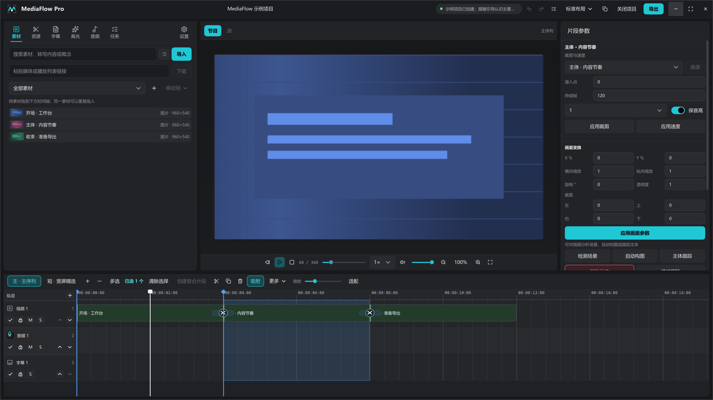
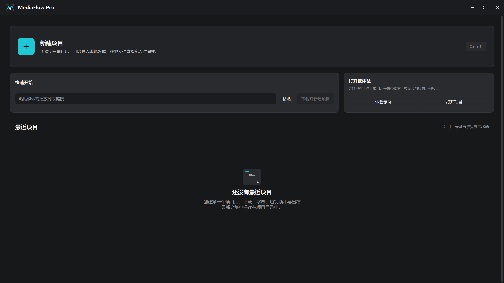

<p align="center">
  
</p>

# MediaFlow Pro

MediaFlow Pro 是面向 Windows 10/11 x64、Ubuntu 24.04 x64 和 macOS 14+ Apple Silicon 的本地视频创作工作站。把视频、音频、图片、字幕或 `editable-media` 网页包交给它，可以在同一个可移动工程中完成素材管理、转写、剪辑、多轨时间线、实时预览、混音、质量检查和最终导出；`project.mfp` 是工程的唯一数据来源。当前仓库提供三平台源码构建和 CI 验证，不提供预打包安装器。



<p align="center"><sub>真实 Qt/QML 界面验收截图：素材、预览、检查器和多轨时间线位于同一个桌面工作区。</sub></p>

项目使用 PySide6/QML 构建桌面界面，Python 承载领域模型与工作流，MLT 统一生成实时预览和最终导出。每个登录用户只有一个按需启动的本机 Editor Service，它持有项目写锁、任务执行器和事件日志；桌面端、CLI 与 MCP 转接器都是客户端。解析抖音、快手直链时，下载任务会按需使用本机 Chrome、Edge 或 Chromium 的无界面 Playwright 会话。

项目采用 GPLv3，下载能力以随运行环境提供的 yt-dlp 为准。

当前仓库提供源码、固定依赖清单和可重复构建入口，不提供便携包或安装器。希望从源码运行、研究或扩展本地媒体工作流，可以从[开发运行环境](#开发运行环境)开始；希望先确认产品覆盖范围，可以先看下面的能力与制作路径。



<p align="center"><sub>首页可以新建空白工程、粘贴链接开始下载，或打开和体验已有项目。</sub></p>

## 选择制作路径

| 你的目标 | 建议使用 | 原因 |
| --- | --- | --- |
| 原片、网页动画、图片、音频和字幕需要进入同一个可继续编辑的工程 | MediaFlow Pro | 提供素材库、多轨时间线、字幕、混音、预览、质量检查和导出闭环 |
| 已经有完整 HTML 动画，只需要确定性渲染成 MP4 | [HyperFrames](https://github.com/heygen-com/hyperframes) | 直接从 HTML 逐帧渲染，不需要先建立非线性编辑工程 |
| 先把确认过的内容制作成社交卡、网页动画、字幕或视频方案 | Visual Multimedia + MediaFlow Pro | Visual Multimedia 负责媒体真源与制作方案，MediaFlow Pro 负责导入、剪辑、审阅和交付 |

MediaFlow Pro 不依赖 HyperFrames，也不会把它引入 `editable-media` 的公共时钟或项目合同。两者可以按任务选择：纯网页动画用 HyperFrames 更直接；需要原片、多轨编辑、字幕、声音和反复修改时使用 MediaFlow Pro。

## 已实现的产品能力

- 可移动项目目录，`project.mfp` SQLite 文件是项目唯一数据来源。
- 主序列与任意数量的短视频序列，共享素材、字幕、翻译和高光候选。
- 多轨视频、音频和字幕时间线；序列用页签直接切换，片段显示素材缩略图带和可拖动的淡入淡出手柄。轨道随素材的拖放位置按需创建，片段可在同类轨道间移动，带音频的视频可解除视音频绑定后分别编辑；支持可见的多选模式、批量检查器、复合片段、成组移动、裁剪、分割、复制、普通删除、跨轨波纹删除、显式添加转场、换源、变速、反向、画面变换和有序视觉效果链，以及时间线与字幕文档共用的撤销/重做历史。拖动片段不会通过重叠自动创建转场。
- 时间线可一键分析最终合成画面的首尾黑屏，并以启用字幕中的首句、末句对白为准设置序列入点和出点；正常画面、音乐或环境声本身不会被视为对白。入出点只限定预览与导出范围，不移动或缩短素材，可继续拖动调整、清除或撤销。
- 源监视器和节目监视器分工明确：素材可先独立预览、设置入出点、截取当前画面，再把选定范围送入时间线；节目监视器继续显示最终合成结果。预览画布支持滚轮缩放、中键平移、直接拖动画面、缩放和旋转，并提供定位、倍速、音量、静音和全屏控制；长片段波形只读取并绘制当前视口覆盖的部分。
- MLT 驱动的同源预览与导出，C++ Qt Quick 插件以独立音频输出作为时钟、用有界视频预解码队列供给帧纹理，并负责定位和掉帧报告。
- 自动代理、波形、素材指纹、离线检测和单个/批量重新定位。
- 统一的转写工作区包含自动字幕、字幕编辑、翻译和术语表；转录前可确认实际源音频时长并选择 Whisper 模型、设备、语言和长音频并行度。任务只提取时间轴真实使用的源区间，内置 faster-whisper 与 Faster-Whisper XXL 都会对超过 15 分钟的音频按静音位置分块，并在资源允许时并行识别。桌面端不加载或展示全量词卡；词级时间作为项目数据保留，供 AI 通过 CLI 生成、预检和应用转录剪辑计划。
- 可编辑网页素材与视觉资源转场中心；网页包和普通视频、图片、音频通过同一素材入口导入，并通过真实浏览器渲染进入时间线，转场悬停通过临时 MLT 图预览。
- 素材可放入持久化的层级文件夹；搜索同时检索文件元数据、关联转写内容和中英文概念，并把真实字幕段与高光候选作为可直接定位的“内容时刻”。场景切点检测、自动构图与主体跟踪会写入时间线标记或画面关键帧。
- 导出后对实际成片执行画面、冻结、静音、True Peak、时长和安全区检查，保留报告、证明帧与导出历史；命名版本保存完整 SQLite 快照并可恢复。支持向 Final Cut Pro / DaVinci Resolve 导出 FCPXML。
- 通过项目无关的公开 CLI 对参考视频和候选成片执行真实解码帧比较，生成逐帧误差、时间偏移、最差帧、边界帧和联系表证据；验收阈值由调用者按当前还原目标提供，MediaFlow Pro 不把某个案例阈值设为全局标准。
- yt-dlp 下载；首页可先读取视频标题、分辨率、帧率与可用画质，再按视频信息创建并打开项目，项目界面显示真实下载进度。YouTube 合集使用扁平分析并保留失效条目位置，X/Twitter 同时识别当前推文和引用推文中的视频，B 站支持合集/分 P，抖音和快手提供浏览器监听回退；faster-whisper 转录；OpenAI 兼容接口翻译与高光分析。
- SDR BT.709 与 HDR10 BT.2020/PQ 工程，支持 H.264、HEVC、AV1、ProRes 和独立字幕导出。
- 多音频总线、内置效果链、ducking、LUFS 和 True Peak 测量；同一时间线快照的并发响度请求只执行一次真实渲染和测量，其余请求等待并复用同一原子结果。
- 中文、英文、日文界面，键盘操作、高 DPI，以及标准、媒体、竖屏三套可持久化工作区；面板可独立隐藏或最大化，标题栏集中显示全局任务状态。首页可创建包含真实素材、双序列、转场、标记和效果链的示例项目，并用四步导览说明完整界面。

## V2 结构

```text
mediaflow/
  domain/             项目、素材、序列、轨道、片段、字幕、音频与导出模型
  application/        编辑命令、任务编排、事件总线和工作流
  infrastructure/     SQLite、yt-dlp、FFmpeg、ASR、LLM、MLT
  desktop/
    controllers/      QML 可调用控制器
    models/           QAbstractListModel
    qml/              页面、组件和设计系统
    native/           最小 MLT Qt Quick C++ 插件
  resources/          字体和 Qt 翻译文件
tests/v2/             V2 单元、QML 与真实媒体集成测试
scripts/              原生构建和验收脚本
```

QML 不直接访问数据库或启动外部程序。桌面端、无头 CLI 和 stdio MCP 转接器都通过同一个常驻 Editor Service 调用 `EditorApplication` / `EditorProject`；只有服务进程能取得项目写锁。Python 类型是唯一合同来源，MLT 图是从 `project.mfp` 编译出的派生结果。

editable-media 的包导入、片段编辑、批量生成和素材换版由四个独立应用服务负责；桌面端的浏览器字段编辑、网页时间线、批量换版与导出也分别由三个 QML 控制器负责。组合对象只装配这些边界，不保留旧总服务或旧控制器转发接口。

完整边界与线程模型见 [ARCHITECTURE.md](ARCHITECTURE.md)。

## 项目目录

```text
<MEDIAFLOW_PROJECT_ROOT>/
  <ProjectName>/
    project.mfp
    generated/
    proxies/
    cache/
    exports/
```

`MEDIAFLOW_PROJECT_ROOT` 是新工程的唯一默认根，`MEDIAFLOW_MEDIA_ROOT` 则保存下载或导入的源媒体。两者都来自当前机器的 `.env`，源码不会根据盘符猜测目录。公开 `project.create` 只接收安全目录名、显示名称和完整项目 profile，由 MediaFlow Pro 在项目根下创建工程并返回绝对路径；调用端不能提交其它工程路径，也不能依赖隐式分辨率或帧率默认值。桌面端只有在用户主动选择其它目录时才偏离该默认值。工程生成的字幕、代理、波形、分析结果和导出仍由各自工程目录管理；素材失踪时保持为离线记录，重新定位需要指纹验证或用户明确确认。

## 开发运行环境

三平台共用 Python 3.12、PySide6 / Qt 6.11.1、yt-dlp 2026.3.17、Playwright 1.61.0 和 OpenCV 5.0.0。媒体运行时按目标平台锁定：

| 目标 | FFmpeg | MLT | 原生工具链 |
| --- | --- | --- | --- |
| Windows 10/11 x64 | 审核过的 n8.1.2 GPLv3 构建 | 审核过的 7.40.0 | MSVC 2022 x64 |
| Ubuntu 24.04 x64 | 审核过的 n8.1.2 GPLv3 构建 | 审核过的 7.40.0 | GCC x64 |
| macOS 14+ Apple Silicon | 审核过的 n8.1.2 GPLv3 构建 | 审核过的 7.40.0 | Apple Clang arm64 |

网页捕获只使用 `runtime.lock.json` 锁定的 Playwright Chromium，不从 `PATH`、浏览器缓存或系统应用目录猜测其它浏览器。OpenCV 负责场景与主体运动分析。

`runtime.lock.json` 是 Windows x64、Linux x64 与 macOS arm64 的 Qt、MLT、FFmpeg、Shotcut 运行时和 Chromium 唯一合同；三个目标都固定审核过的版本、归档布局和 SHA-256，不读取系统安装的媒体工具作为后备。`requirements.lock` 固定三平台共用的 Python、测试和构建依赖图；[`.env.example`](.env.example) 是机器路径变量的唯一公开合同。复制为被 Git 忽略的 `.env` 后，至少配置开发工具根、工程根和媒体根：

| 变量 | 用途 |
| --- | --- |
| `MEDIAFLOW_DEV_ROOT` | Python 环境、SDK、运行时、构建、缓存和测试产物的共同父目录 |
| `MEDIAFLOW_PROJECT_ROOT` | 新建 MediaFlow Pro 工程的默认根 |
| `MEDIAFLOW_MEDIA_ROOT` | 下载、导入和转写源媒体的应用级根 |
| `VISUAL_MULTIMEDIA_ROOT` | 需要同步 `editable-media` 合同样本时使用的生产者仓库位置 |

进程中已经设置的环境变量优先于 `.env`。运行时只允许通过 `MEDIAFLOW_RUNTIME_DIR` 选择整套根目录，FFmpeg、FFprobe、MLT、Chromium、Qt 和原生 QML 的具体路径全部由当前平台合同推导，不能分别覆盖。`MEDIAFLOW_SERVICE_STATE_DIR`、`MEDIAFLOW_TEST_ROOT` 和 `MEDIAFLOW_TEST_FIXTURE_ROOT` 只用于隔离服务状态与测试产物，不参与运行时发现。

创建开发环境：

```powershell
Copy-Item .env.example .env
# 编辑 .env 后加载当前机器配置
. .\scripts\load_environment.ps1
$venvRoot = Split-Path -Parent (Split-Path -Parent $env:MEDIAFLOW_PYTHON)
py -3.12 -m venv $venvRoot
& $env:MEDIAFLOW_PYTHON -m pip install --require-hashes -r requirements.lock
& $env:MEDIAFLOW_PYTHON -m pip install --no-deps --no-build-isolation -e .
```

Linux 与 macOS 使用同一个 `.env` 合同和 Python 包入口；先把示例中的路径改成当前机器的绝对路径，再执行：

```bash
cp .env.example .env
# 编辑 .env 后把路径变量加载到当前 shell
set -a
. ./.env
set +a
python3.12 -m venv "$MEDIAFLOW_DEV_ROOT/.venv"
"$MEDIAFLOW_DEV_ROOT/.venv/bin/python" -m pip install --require-hashes -r requirements.lock
"$MEDIAFLOW_DEV_ROOT/.venv/bin/python" -m pip install --no-deps --no-build-isolation -e .
```

`pyproject.toml` 只声明直接依赖，`requirements.lock` 是开发、测试和构建环境实际安装版本的唯一清单。修改依赖后，使用锁文件中固定的 `pip-tools` 重新生成并审查完整依赖图：

```powershell
& $env:MEDIAFLOW_PYTHON -m piptools compile pyproject.toml --extra dev --extra build --generate-hashes --resolver backtracking --allow-unsafe --strip-extras --output-file requirements.lock
```

Linux/macOS 对应命令是 `"$MEDIAFLOW_DEV_ROOT/.venv/bin/python" -m piptools compile pyproject.toml --extra dev --extra build --generate-hashes --resolver backtracking --allow-unsafe --strip-extras --output-file requirements.lock`。

原生预览插件要求完整 Qt 6.11.1 SDK、CMake/Ninja，以及当前平台的 C++20 工具链：Windows 使用 MSVC 2022，Linux 使用 GCC，macOS 使用 Apple Clang。先用跨平台脚本按合同准备整套运行时和 Qt SDK，再构建插件：

```powershell
& $env:MEDIAFLOW_PYTHON scripts\prepare_runtime.py --runtime-root $env:MEDIAFLOW_RUNTIME_DIR
& $env:MEDIAFLOW_PYTHON scripts\prepare_ci_qt.py --qt-root (Join-Path $env:MEDIAFLOW_RUNTIME_DIR "qt")
& $env:MEDIAFLOW_PYTHON scripts\build_native.py --runtime-root $env:MEDIAFLOW_RUNTIME_DIR
```

Linux/macOS 使用相同入口：

```bash
"$MEDIAFLOW_DEV_ROOT/.venv/bin/python" scripts/prepare_runtime.py --runtime-root "$MEDIAFLOW_RUNTIME_DIR"
"$MEDIAFLOW_DEV_ROOT/.venv/bin/python" scripts/prepare_ci_qt.py --qt-root "$MEDIAFLOW_RUNTIME_DIR/qt"
"$MEDIAFLOW_DEV_ROOT/.venv/bin/python" scripts/build_native.py --runtime-root "$MEDIAFLOW_RUNTIME_DIR"
```

CI 按操作系统、架构、精确 Python 版本和 `requirements.lock` 摘要缓存完整虚拟环境，每个任务只刷新当前源码的 editable 安装并运行 `pip check`。普通核心测试拆成两个不准备 Qt SDK、MLT/FFmpeg 运行时、Chromium 或原生插件的轻量分片；只有经过审查、确实依赖这些资源的测试才在完整运行中进入四个运行时分片，不为测试库机械增加多层 marker。需要媒体运行时的任务使用 `scripts/prepare_runtime.py` 校验 SHA-256 后展开当前目标的 Shotcut 运行时和 Playwright Chromium，并由 `scripts/prepare_ci_qt.py` 直接校验、展开 `runtime.lock.json` 登记的 QtBase 与 QtDeclarative 官方归档，不依赖在线仓库元数据解析，随后现场编译原生插件。Linux 与 macOS 会在更昂贵的 portable 合同和跨平台交接链之前运行原生预览冒烟。`scripts/verify_development_runtime.py --profile core` 会实际启动 FFmpeg、MLT 与 Chromium并核对原生 QML 包；`--profile full` 另外要求本机已安装 ASR 与语音合成组件。不能用跳过测试代替运行时准备。

启动应用：

```powershell
.\scripts\launch.ps1
```

Linux/macOS 直接运行同一个应用模块：

```bash
"$MEDIAFLOW_DEV_ROOT/.venv/bin/python" -m mediaflow.desktop.app
```

三平台都可以把项目目录作为首个参数直接打开。

桌面日志保存在运行目录的 `logs\\mediaflow.log`，文件达到 5 MiB 后轮转并保留 5 个备份。操作失败弹窗末尾的短编号会原样写入日志；反馈问题时同时提供该编号即可定位对应异常。

## 无头 CLI

`mediaflow-cli` 是常驻 Editor Service 的结构化薄客户端。第一次调用会按需启动服务，之后的短进程只发送请求；它不打开 `project.mfp`、不取得项目锁，也不复制任务实现。CLI 使用 `mediaflow-editor` v3 JSON 合同，始终以 UTF-8 向标准输出写 JSON，失败时返回非零退出码和稳定错误码。调用方应先读取 `describe`，再按每项操作声明的项目访问方式、执行方式、幂等策略、所需能力以及输入和结果 schema 选择操作；需要外部运行时的操作还应先调用 `runtime.inspect`。

每个项目写请求必须提供稳定 `request_id`、最近一次读取得到的 `base_revision`、`actor` 和 `client_id`。服务先检查持久化回执，再检查修订：完全相同的重试直接返回第一次结果；过期但写入路径不相交时自动重放；同一路径已经被人或另一代理修改时返回结构化冲突，不静默覆盖。服务提交数据库与事件后才返回，桌面端通过带游标的 WebSocket 立即投影外部改动。WebSocket 的 `project.subscribe` 会按游标补发 `project.changed` 和 `task.changed`，并继续发送同项目的 `project.conflict` 与工作区事件；无需项目的观察者可用 `service.subscribe` 接收 `runtime.changed` 和 `service.stopping`。`operation.execute_batch` 把一组原子 AI 写入归入同一个 `undo_group_id`，用户一次撤销即可恢复整批操作。

`quality.reference.compare` 不打开或修改项目。它读取两个本地视频的真实解码帧，按调用者给出的区间、邻帧搜索范围和可选验收条件生成 `reference-comparison.json`、最差帧对照图和联系表。没有验收条件时结果为 `measured`；只有显式条件存在时才返回 `passed` 或 `failed`。逐帧数值不能替代对内容、构图、动作和风格的完整观看。

旧项目需要改变数据结构时，桌面端在取得项目写锁后一次性升级。只读 CLI 不会暗中修改项目，而是返回 `upgrade_required`；调用方应按当前 `describe` 中的合同提交一次带 `request_id` 的 `project.upgrade`，成功后再重试原操作。

```powershell
mediaflow-cli describe
Get-Content request.json -Raw | mediaflow-cli execute --request -
```

Linux/macOS 使用 `cat request.json | mediaflow-cli execute --request -`，其余 CLI 合同完全相同。

自动化程序也可以通过文件或标准输入发送统一请求：

```json
{
  "protocol": "mediaflow-editor",
  "version": 3,
  "operation": "task.start",
  "project": "<absolute-project-directory>",
  "request_id": "stable-request-id",
  "base_revision": 12,
  "actor": {"kind": "agent", "id": "my-agent", "name": "My Agent"},
  "client_id": "my-client",
  "arguments": {
    "task_command": {
      "command_type": "generate_waveform",
      "asset_id": "素材 ID"
    },
    "input_asset_ids": ["素材 ID"]
  }
}
```

```powershell
mediaflow-cli execute --request request.json
Get-Content request.json -Raw | mediaflow-cli execute --request -
```

AI 文字剪辑使用 `transcript.get`、`transcript.edit.preview`、`transcript.edit.apply` 三步合同。AI 必须先读取带项目修订号的源转录，再提交包含删除理由和词或字幕段 ID 的计划；应用命令只接受原样返回的预检计划，并在修改前自动创建命名恢复版本。只有识别器提供的真实词级时间可以按词删除，估算词时间只能通过完整字幕段删除。预检发现锁定轨道可能失去同步时，应用方必须在审阅警告后显式传入 `accept_warnings: true`。`project.version.list` 和 `project.version.restore` 可用于检查和恢复自动保存的版本。

普通片段换源和视觉效果链也走公开合同：`timeline.clip.source.replace` 负责在同类素材间换源并重新校验源区间，`timeline.clip.effect.add/update/move/remove` 负责按稳定效果 ID 建立、调整、重排和移除效果。具体参数、读写方式和返回结构仍以当前机器的 `mediaflow-cli describe` 为准。

支持 MCP 的宿主可以把 `mediaflow-mcp` 配置为 stdio server。它使用官方 MCP Python SDK，只公开 `mediaflow_describe`、`mediaflow_execute`、`mediaflow_execute_batch`、`mediaflow_follow_events` 和 `mediaflow_workspace_command` 五个薄工具，并复用同一个 Editor Service 连接池。服务启动时会从实时 `system.describe` 为 `mediaflow_execute` 生成各操作的联合输入 schema，事件跟随直接消费项目 WebSocket，工作区命令只作用于桌面明确连接的会话；转接器不监听公网端口，也不包含第二套编辑实现。

### 可编辑网页素材

MediaFlow Pro 可导入 `editable-media` v5 本地网页包。网页包用 `window.editableMedia` 暴露结构化编辑状态，并用 `window.__hf.duration/seek(seconds)` 暴露唯一的确定性逐帧边界。包内 media-sources v4 素材账本的每个媒体源必须明确声明由浏览器渲染、由 FFmpeg 作为原生音频解码，或由 FFmpeg 作为原生视频底层解码；MediaFlow Pro 不再根据扩展名或 DOM 用法猜测处理方式。进程级 `WebCaptureEngine` 复用本机 Chromium，按素材长度、画布大小、逻辑处理器和可用内存启用有界并行页面，通过 Chrome 的快速无损截图接口取得透明 PNG，再严格按帧序交给同一个 FFmpeg 输入管道。原生视频在该管道内完成缩放、裁切或留边并与浏览器透明画面合成，原生音频也在同一次编码中完成定位、循环、增益和混音，最终形成同时供预览、MLT 时间线和交接导出读取的单一 MKV 缓存。

已经保存在旧项目里的最终版 editable-media v4 资产不再进入第二套运行分支。项目升级会把清单、全部 `WebClipState` 和标准运行时一起迁移到 v5，经过包闭包与真实浏览器校验后发布新包，再在同一项目事务中切换引用；旧 v4 包移入项目的 `archive/web`，供人工追溯但不再参与运行。迁移失败时数据库和旧包保持原状，失败的新包进入归档，重新打开项目即可重试。

验证器和生产捕获共用同一条 `await seek → 强制布局与样式刷新` 边界，不再为每帧固定等待一次浏览器动画帧。首次捕获会用帧 0 锚点和前后跳转验证随机访问；实验性的 `drawElementImage` 必须在每个 worker 上分别通过真实截图的原图 PSNR、模糊结构 PSNR、平均误差、局部最大误差、Alpha 和稳定阶段耗时联合对照，所有 worker 一致通过后才会接管。一次性 Canvas 初始化不参与稳定捕获计时，避免某个 worker 因冷启动误判后拖累整次任务。高速后端若在正式捕获中失效，当前 FFmpeg 尝试会被整体废弃并从帧 0 改用截图路径重跑，不会留下混合后端缓存。纯浏览器画面的 610 帧重复基准中，四个 worker 的快速后端输出与单 worker 输出始终 610 帧逐帧一致，耗时为 14.89–16.74 秒、吞吐为 36.45–40.98 fps。MediaFlow Pro 保留自己的项目状态、缓存键、原子输出和 MLT 合成边界，不引入 HyperFrames 依赖或第二套网页动画时钟。

网页包保存组件结构与复杂动画，`project.mfp` 的 `WebClipState` 保存每个片段的文字、样式、比例布局、图层关键帧、自定义参数、参数关键帧、主题、数据快照和字段锁。属性面板与自动化共同读取由当前清单、变体、场景和状态推导的编辑描述，不再分别维护硬编码字段表。桌面时间条直接显示片段区间、图层关键帧和参数关键帧；拖动期间通过同一浏览器时钟实时预览，吸附帧网格与清单语义步骤，释放时只提交一次。网页素材换版先生成带摘要的严格迁移计划，逐路径解决冲突后再原子提交；源包或片段修订变化会使计划失效，不存在隐式冲突放行。原网页目录会保留而不会被回写。导入扫描会同时计算全包身份和每个媒体文件的 SHA-256、字节数及服务 MIME 类型；复制到项目时最多并行处理四个文件，并在写入过程中复核字节数和 SHA-256，不会在落盘后再次完整读取大型视频。发布目录提交后不可变，换版只会创建新的发布目录；渲染直接使用发布时保存的内容哈希，显式素材审计才重新读取全包。带原生音频的网页素材会建立绑定视音频剪辑，不会为 HTML 入口错误生成波形。缓存键包含浏览器状态、原生媒体时间线、素材内容、帧范围和音频规格；只有视频流、可选 FLAC 音频流、帧目标、边缘内容指纹和原子 manifest 全部通过 FFprobe 与内容校验时才会命中。可通过 `MEDIAFLOW_WEB_WORKERS=1..8` 限制捕获进程数；默认最多使用 4 个，并按帧数、分辨率、逻辑处理器和实时可用内存自动收缩，诊断会记录实际限制来源及 seek、捕获、队列等待和帧耗时分位数。

相关能力可从 `mediaflow-cli describe` 读取，包括 `project.version.create/list/restore`、`web.import`、`web.clip.edit.describe`、`web.clip.keyframe.*`、`web.clip.parameter.*`、`web.clip.theme.update`、`web.clip.variant.select`、`web.clip.data.*`、`web.clip.diff`、`web.batch.create`、`web.asset.rebind.plan/commit`、`web.clip.export`、`quality.reference.compare` 和会在无法保留语义时明确拒绝的 `export.fcpxml`。远程网址、登录态网页和任意 DOM/CSS 可视化开发不属于该边界。

## 测试与真实验收

```powershell
. .\scripts\load_environment.ps1
& $env:MEDIAFLOW_PYTHON -m pytest tests\v2
& $env:MEDIAFLOW_PYTHON -m scripts.verify_development_runtime --profile core
& $env:MEDIAFLOW_PYTHON -m scripts.verify_ui_matrix
& $env:MEDIAFLOW_PYTHON -m scripts.verify_performance
& $env:MEDIAFLOW_PYTHON -m scripts.verify_preview_performance
& $env:MEDIAFLOW_PYTHON -m scripts.verify_web_render_performance
& $env:MEDIAFLOW_PYTHON -m scripts.verify_reference_comparison_chain --package tests\fixtures\editable-media-v5
& $env:MEDIAFLOW_PYTHON -m scripts.verify_display_capabilities
```

测试覆盖领域计算、SQLite 事务、QML 页面、原生预览、代理、下载、转录、翻译、高光、MLT 导出、HDR 元数据及预览/导出抽帧比对。上述默认验收均可离线运行。`scripts.verify_real_user_chain` 需要真实 `OPENAI_API_KEY` 和在线模型，只在明确配置 `MEDIAFLOW_RUN_ONLINE_E2E=true` 的凭据环境执行；它不会在没有凭据时伪造生产结果或冒充完整链路通过。

## 许可与分发

MediaFlow Pro 源码以 [GNU GPL v3](LICENSE) 发布。随运行目录提供的 Qt、MLT、FFmpeg、yt-dlp、Python 包及其他组件仍适用各自许可证，详见 [THIRD_PARTY_NOTICES.md](THIRD_PARTY_NOTICES.md)。

本仓库只维护可重复构建脚本和依赖清单；除非项目所有者明确要求，不生成便携包或安装器。

## Star History

<picture>
  <source media="(prefers-color-scheme: dark)" srcset="https://raw.githubusercontent.com/CheshireMew/MediaFlow-Pro/star-history/star-history-dark.svg">
  <source media="(prefers-color-scheme: light)" srcset="https://raw.githubusercontent.com/CheshireMew/MediaFlow-Pro/star-history/star-history.svg">
  
</picture>
