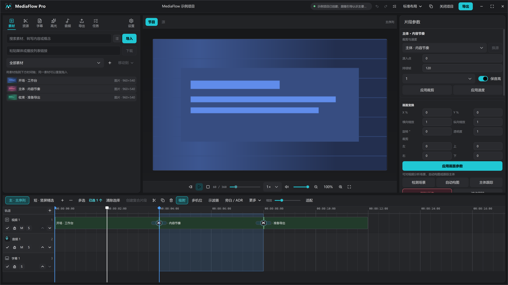
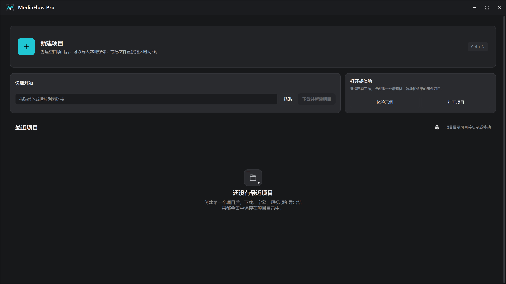

<p align="center">
  
</p>

# MediaFlow Pro

<!-- readme-header:start -->

<p align="center">
  <strong>中文</strong> · <a href="./README.en.md">English</a> · <a href="./README.ja.md">日本語</a> | <a href="./ARCHITECTURE.md">文档</a> | <a href="./CONTRIBUTING.md">贡献</a> | <a href="https://github.com/CheshireMew/MediaFlow-Pro/issues">反馈</a>
</p>

<p align="center">
  <a href="https://x.com/0xCheshire" title="X"></a>
  <a href="https://t.me/CheshireBTC" title="Telegram"></a>
  <a href="https://blog.blacknico.com/" title="Blog"></a>
  <a href="https://blacknico.com/" title="Homepage"></a>
</p>

<p align="center">
  <a href="https://github.com/CheshireMew/MediaFlow-Pro/stargazers"></a>
  <a href="https://github.com/CheshireMew/MediaFlow-Pro/forks"></a>
  <a href="https://github.com/CheshireMew/MediaFlow-Pro/blob/main/LICENSE"></a>
</p>

<!-- readme-header:end -->

MediaFlow Pro 是一套以项目为中心的本地视频创作工作站。把视频、音频、图片、字幕、媒体链接或 `editable-media` v6 网页包交给它，可以在同一个可移动工程里完成素材管理、转写、剪辑、多轨时间线、实时预览、混音、质量检查和最终导出。

`project.mfp` 是工程状态的唯一数据来源；预览与导出都从同一条时间线编译，避免“编辑器里看到的”和“最后导出的”走两套逻辑。

[快速开始](#快速开始) · [产品能力](#你可以用它做什么) · [editable-media](#editable-media-网页包) · [CLI 与 MCP](#cli-与-mcp-自动化) · [架构说明](ARCHITECTURE.md)



<p align="center"><sub>真实 Qt/QML 桌面验收截图：素材、预览、检查器和多轨时间线位于同一个工作区。</sub></p>

> [!IMPORTANT]
> 当前仓库交付源码、固定依赖和可重复构建入口，不提供预打包安装器。Windows 10/11 x64 覆盖完整桌面、原生预览和导出验收；Ubuntu 24.04 x64 与 macOS 14+ Apple Silicon 已具备源码构建、运行时合同、CI 构建和原生预览冒烟，但尚未宣称完成对应平台的完整实机发布验收。

## 适合哪些工作

| 你要完成的事情 | MediaFlow Pro 提供的结果 |
| --- | --- |
| 把原片、图片、音频和字幕剪成可反复修改的视频 | 可移动项目、多轨时间线、同源预览与导出 |
| 把结构化网页动画和普通素材放进同一条时间线 | `editable-media` v6 导入、统一字段编辑、关键帧、换版、真实时间胶片条与可恢复的浏览器逐帧渲染 |
| 根据转录文字做剪辑、翻译或高光处理 | 转录工作区，以及可预检、可撤销的 CLI 自动化操作 |
| 检查成片是否符合交付要求 | 黑帧、冻结、静音、响度、时长、安全区和参考视频对照报告 |
| 下载网络媒体后继续编辑 | yt-dlp 视频与播放列表下载、小宇宙单集音频下载、项目创建与真实进度展示 |

如果你只需要把完整 HTML 动画确定性渲染成视频，而不需要非线性编辑工程，[HyperFrames](https://github.com/heygen-com/hyperframes) 会更直接。MediaFlow Pro 面向需要原片、多轨、字幕、声音和后续修改的制作链。

## 快速开始

### 1. 准备环境

需要 Python 3.12、当前平台的 C++20 工具链，以及足够容纳 Qt、MLT、FFmpeg、Chromium、缓存和媒体文件的磁盘空间。运行时版本和 SHA-256 由 [`runtime.lock.json`](runtime.lock.json) 固定，Python 依赖由 [`requirements.lock`](requirements.lock) 固定。

YouTube 下载还需要 PATH 中有 Node.js 22 以上版本或 Deno 2.3 以上版本；应用会自动启用已安装的运行环境。EJS 随 Python 依赖安装，设置中的 yt-dlp 更新也会同时安装匹配的 EJS，全部成功后才切换版本。公开视频默认不需要账号 Cookie，只有内容确实需要登录或账号权限时才在下载设置中提供。解析警告会保留在应用日志中，机器人验证、403、限流和 Cookie 读取失败各自显示具体原因。

更新后需重启后台服务以加载新版本：等待正在运行的任务完成并关闭应用，在已加载项目环境的终端执行 `& $env:MEDIAFLOW_PYTHON -m mediaflow.cli service shutdown`，再启动应用。后台服务未运行时直接启动应用即可；仅关闭窗口不会停止常驻服务。

先复制 [`.env.example`](.env.example) 并填写三个机器级目录：

| 变量 | 用途 |
| --- | --- |
| `MEDIAFLOW_DEV_ROOT` | Python 环境、SDK、运行时、构建和缓存 |
| `MEDIAFLOW_PROJECT_ROOT` | 新项目的默认保存根目录 |
| `MEDIAFLOW_MEDIA_ROOT` | 下载、导入和转写源媒体的应用级根目录 |

Windows PowerShell：

```powershell
Copy-Item .env.example .env
# 编辑 .env 后继续
. .\scripts\load_environment.ps1

py -3.12 -m venv (Join-Path $env:MEDIAFLOW_DEV_ROOT ".venv")
& $env:MEDIAFLOW_PYTHON -m pip install --require-hashes -r requirements.lock
& $env:MEDIAFLOW_PYTHON -m pip install --no-deps --no-build-isolation -e .

& $env:MEDIAFLOW_PYTHON scripts\prepare_runtime.py --runtime-root $env:MEDIAFLOW_RUNTIME_DIR
& $env:MEDIAFLOW_PYTHON scripts\prepare_ci_qt.py --qt-root (Join-Path $env:MEDIAFLOW_RUNTIME_DIR "qt")
& $env:MEDIAFLOW_PYTHON scripts\build_native.py --runtime-root $env:MEDIAFLOW_RUNTIME_DIR
```

<details>
<summary>Ubuntu / macOS 命令</summary>

```bash
cp .env.example .env
# 编辑 .env 后继续
set -a
. ./.env
set +a

export MEDIAFLOW_RUNTIME_DIR="${MEDIAFLOW_RUNTIME_DIR:-$MEDIAFLOW_DEV_ROOT/runtime}"
export MEDIAFLOW_PYTHON="${MEDIAFLOW_PYTHON:-$MEDIAFLOW_DEV_ROOT/.venv/bin/python}"

python3.12 -m venv "$MEDIAFLOW_DEV_ROOT/.venv"
"$MEDIAFLOW_PYTHON" -m pip install --require-hashes -r requirements.lock
"$MEDIAFLOW_PYTHON" -m pip install --no-deps --no-build-isolation -e .

"$MEDIAFLOW_PYTHON" scripts/prepare_runtime.py --runtime-root "$MEDIAFLOW_RUNTIME_DIR"
"$MEDIAFLOW_PYTHON" scripts/prepare_ci_qt.py --qt-root "$MEDIAFLOW_RUNTIME_DIR/qt"
"$MEDIAFLOW_PYTHON" scripts/build_native.py --runtime-root "$MEDIAFLOW_RUNTIME_DIR"
```

</details>

### 2. 启动应用

Windows：

```powershell
.\scripts\launch.ps1
```

Ubuntu / macOS：

```bash
"$MEDIAFLOW_PYTHON" -m mediaflow.desktop.app
```

三平台都可以把项目目录作为首个参数传入，直接打开已有项目。

### 3. 完成第一次编辑

1. 在首页新建空白项目，或打开内置示例了解完整界面。
2. 导入本地媒体、字幕、网页包，或粘贴媒体链接开始下载。
3. 把素材拖入时间线，完成裁剪、字幕、混音和画面调整。
4. 在节目监视器检查最终合成结果，再从“导出”生成成片和质量报告。



<p align="center"><sub>首页可以新建项目、粘贴链接开始下载，或打开和体验已有项目。</sub></p>

## 你可以用它做什么

| 工作区 | 已实现能力 |
| --- | --- |
| 项目与素材 | 可移动项目目录、外部素材归集、可迁移项目归档、素材文件夹、代理、波形、指纹、离线检测、重新定位、版本快照和时间码审阅 |
| 时间线 | 多序列、多轨视频/音频/字幕、裁剪、分割、复制、波纹删除、转场、换源、变速、反向、复合片段、多机位、关键帧、蒙版、效果链和统一撤销/重做 |
| 预览与画面 | 源监视器、节目监视器、画布变换、色轮、直方图/波形图/矢量示波器、原生音频时钟、HDR/SDR 工程和 MLT 同源预览 |
| 文字与字幕 | faster-whisper / Faster-Whisper XXL 转录、字幕编辑、翻译、术语表、多人说话人识别和基于真实词级时间的文字剪辑 |
| 音频 | 多总线、效果链、ducking、LUFS、True Peak、旁白/ADR 提示与 take 管理，以及按说话人克隆音色的跨语言配音 |
| 分析与交付 | 场景切点、主体跟踪、黑帧/冻结/静音检查、参考视频逐帧对照、H.264/HEVC/AV1/ProRes、独立字幕、FCPXML 导出及 FCPXML/CMX 3600 EDL 导入 |
| 界面与工作区 | 中文、英文、日文界面，高 DPI、键盘操作，以及标准、媒体、竖屏三套可持久化布局 |

下载与按需运行组件的实际可用性取决于当前站点和本机环境。远程登录态网页不属于 `editable-media` 导入边界；网页包必须是本地、可验证、可确定性定位的目录。

大型项目不会把整条时间线、整份波形或全部事件反复传给桌面端：片段移动使用增量变更，事件流按游标确认，长音频使用可按范围读取的多级二进制波形。原生预览由同一个音频时钟驱动画面，使用有限队列和明确的丢帧计数；服务启动、项目装配和首页请求也分开执行，避免互相阻塞首屏。

## 原生关键帧、蒙版与局部效果

视频片段的位移、缩放、旋转、裁切和不透明度，以及支持动画的视觉效果参数，都可以使用保持、线性、缓入、缓出、缓入缓出或自定义贝塞尔曲线制作关键帧。桌面端支持逐帧移动、整体时间缩放、复制和粘贴；CLI 暴露同一组可撤销操作，预览与导出共同读取项目中的关键帧真源。

每个视频片段可以建立矩形、椭圆、多边形或带入射/出射控制柄的 Bezier 蒙版，在节目监视器上直接拖动形状、锚点和控制柄，并按稳定顺序使用替换、添加、减去、交集组合。反转、羽化、不透明度和动画继续作用于每个独立蒙版，再将单个视觉效果绑定到组合后的指定蒙版形成局部效果。蒙版跟踪作为可取消、可恢复的后台任务运行，结果写回源帧关键帧，因此剪切、变速和重新排列片段后仍使用统一时间映射。MLT 预览与成片会按相同顺序组合蒙版和效果；FCPXML 无法可靠表达这些私有效果时会在写文件前明确拒绝，不会静默丢失。

## 母版与多尺寸交付版本

任意非派生序列都可以一次生成横屏 16:9、竖屏 9:16、方形 1:1 和竖屏 4:5 交付版本，CLI 还可以提交最多八个自定义偶数尺寸。派生时会复制完整轨道、音频总线、字幕放置、复合片段、转场、原生关键帧、蒙版与局部效果；画面可以保留母版构图，也可以按素材与目标画布比例居中铺满。每个版本都是独立可编辑序列，并记录母版的同步基线与时间线修订号。母版变化后界面会标记“需更新”；重新生成会用稳定实体 ID 做三方合并，自动接收母版单边变化并保留版本单边调整，真正冲突会在写入前按字段列出并要求逐项决定。更新原序列而不是归档重建，整个刷新仍可撤销、重做。公开入口为 `sequence.variant.list/plan/generate`。

## 项目归集与可迁移归档

“版本与归档”窗口可以把项目引用的外部文件或网页素材目录复制到 `sources/collected`。复制前后会计算完整 SHA-256；项目只会在校验通过后切换到归集副本，同时保留每个素材的原路径。路径切换支持撤销、重做，也可以显式恢复最近一次归集前的路径。公开入口为 `project.collection.preview/list/apply/state.set`。

“创建可迁移项目”只接受已经归集完全部外部素材的项目。它使用 SQLite 一致性备份复制 `project.mfp`，连同受管素材和经过哈希确认的命名版本快照写入新的独立目录，不复制代理、波形、浏览器帧缓存和导出缓存。发布前会逐文件复核清单并以只读方式重开归档项目，确认所有素材可用；`archive-manifest.json` 记录内容修订、schema 版本、文件大小和 SHA-256。公开入口为 `project.archive.create`。

## 时间码审阅与交付闭环

审阅批注直接保存在项目时间线中，可以绑定单帧、帧区间和当前片段，并记录主题、优先级、发起人、完整回复和解决人。审阅者可以从当前项目修订渲染并固定截图，在画面上直接绘制自由线、箭头、矩形、椭圆和文字；截图同时绑定项目修订、时间线修订、尺寸与 SHA-256。待处理、已解决和已归档三种状态都支持筛选；归档不会删除内容，恢复后会回到归档前的状态。`.mfr` 审阅包可以连同截图、矢量标注和附件校验哈希导出，在另一个工程中验证后重新绑定导入。桌面端与 `review.*` CLI 操作读取同一份项目真源，自动化也能检查仍会阻断交付的问题。

## 多机位、专业调色与交换时间线

多机位工具可以手动指定同步帧，也可以读取素材起始时码或对已经生成的音频波形做相关分析，返回每个机位的同步帧、偏移跨度和可信度后再创建可编辑节目轨。节目音频可以跟随画面切换，也可以固定为某个带音频的主机位并在所有画面切点之间保持一条连续音频片段。播放头位于节目范围内时可以随时切换机位；切点会重建真实原生片段，而不是保存只能由界面理解的临时选择。`multicam.*` 公开操作与桌面端读取同一组同步方法、音频策略、机位和切点，并完整进入撤销、重做和项目版本。

调色工具除了现有 LUT 与基础画面参数，还提供阴影、中间调、高光三组 RGB 色轮。直方图、亮度波形图、RGB Parade 和矢量示波器从当前时间线最终合成帧计算，桌面端与 `color.scope.analyze` 使用同一分析结果。色轮作为原生视觉效果进入 MLT 图，因此实时预览和最终导出不会出现两套颜色。

“版本与归档”窗口可以先检查再导入 FCPXML 或 CMX 3600 EDL。导入始终创建新的原生可编辑序列，不覆盖当前时间线；素材缺失时逐项重新定位。FCPXML 会保留精确分数帧率、素材区间、恒定变速、变换、裁切、透明度、音量、淡入淡出、标记、字幕和标准溶解，EDL 支持普通及 29.97/59.94 drop-frame 时间码。无法无损表达的可变速或非线性关键帧会在写入项目前明确拒绝。公开入口为 `timeline.interchange.inspect/import`。

## 旁白录制与 ADR

“旁白 / ADR”窗口可以按时间线帧区间建立台词提示，记录说话人、表演说明和待录制/待审听/已通过状态。录音前有三秒倒计时，桌面端可以选择输入设备，以 48 kHz 单声道 WAV 实际录制，并在提示结束时自动停止；也可以直接导入外部音频。每个输入设备可以播放并录回确定性测试声完成声学往返延迟校准，也可以输入经过外部测量的手动值。每次录音成为独立 take 时会固化当时的设备、采样率和补偿样本数；放入时间线时按序列帧率换算源入点并裁掉前端延迟，设备以后重新校准不会改变旧 take。take 继续支持命名、备注、五星评分、选用和归档，并优先路由到对白总线。公开入口为 `voiceover.cue.*`、`voiceover.take.*` 与 `voiceover.latency.*`。

## 多人跨语言配音

“文本与字幕 → 多人配音”可以把没有重叠讲话的英文对白转换为中文配音。把音频放入主要对白轨后，如果还没有英文字幕，可以直接在配音面板启动正式转录任务，无需切换工作区。默认流程把英文转写片段作为已经确定的语音区间，用本地 3D-Speaker CAM++ 中英双语模型提取音色并聚类，不需要 Hugging Face 账号、模型授权或访问令牌；只有多人同时说话等重叠语音场景才需要在设置中切换到 Community-1。随后按真实词级时间抽取每人 3.0–9.8 秒、音频与原文严格对应的多个参考片段；导入字幕没有词时间且必须截取长句时，会明确要求人工核对参考原文。系统保留字幕的一对一翻译关系，再用同一个 GPT-SoVITS v2Pro 服务逐句合成。界面允许修改说话人、主参考音频、参考原文、译文和人工确认状态；超长译文会先借用后续静音、再在设定上限内加速，仍然过长时保留完整语音并明确标为待复核，不会截断句尾。最终母版作为一条可更新的音频轨提交到时间线。

本地音色聚类使用独立 Python 环境，避免语音模型依赖影响 MediaFlow 主环境。Windows 示例：

设置页点击“安装本地模型”即可准备 3D-Speaker；开发环境也可以运行：

```powershell
.\scripts\setup_speaker_diarization.ps1
```

安装器会在 `MEDIAFLOW_RUNTIME_DIR\tools` 下创建隔离环境，固定安装 `sherpa-onnx` 和 NumPy，下载约 28 MB 的 CAM++ 模型并核对 SHA-256，不使用 C 盘。若确实需要处理多人同时讲话，可运行 `.\scripts\setup_speaker_diarization.ps1 -Backend community_1 -Device auto` 安装 Community-1 的独立 PyTorch 环境，再在设置中填写 Hugging Face 令牌。公开自动化入口为 `dubbing.prepare`、`dubbing.speaker.update`、`dubbing.reference.update`、`dubbing.utterance.update`、`dubbing.synthesize` 和 `dubbing.commit`，精确参数仍以 `mediaflow-cli describe --operation <名称>` 为准。

## `editable-media` 网页包

MediaFlow Pro 正式消费通用的 `editable-media` v6 本地网页包，不依赖某个生产者的仓库布局或案例名称。DOM、React 或其它前端技术都只是成品包的生产方式；导入后统一成为普通 Web 素材，不会形成第二套项目状态或导出管线。

- `window.editableMedia` 提供文字、样式、变体、场景、图层、参数和素材槽等结构化状态。
- `window.__hf.duration`、异步 `window.__hf.seek(seconds)`、renderer 注册和 frame task 共同提供唯一的确定性逐帧时间与准备边界。
- 网页包明确声明素材由浏览器渲染，还是作为原生视频底层或原生音频进入合成；MediaFlow Pro 不根据扩展名猜测。
- 原始网页包不会被回写。片段状态、换版记录和项目引用保存在 `project.mfp`，发布后的项目内网页目录保持不可变。
- 浏览器画面、原生视频和原生音频会进入同一个缓存与 FFmpeg 编码管道，供预览、时间线和导出共同消费。
- 不走直接 H.264 的纯网页长动画会按固定 10 秒帧段保存无损缓存。相同网页包、完整状态、画布和帧率下，重试、续长或再次导出只补算缺失帧段；带原生视频或原生音频的网页合成仍由原有完整管线处理，不会把不同路线的帧混在一起。打开已有网页项目时会在后台预热一个有空闲期限的 Chromium worker。
- 网页缓存会先生成可检查的渲染计划。当前自动快路严格限于工作量足够的 UHD 3840×2160（或竖版 2160×3840）、30/29.97fps、不透明 SDR 动画；1080p、720p、4K24、4K60、透明画布、原生视频底层、短片和静态兼容性阻断项继续使用保留透明信息的 FFV1/PNG 逐帧管道。
- 直接 H.264 使用 Chromium 的 HTML in Canvas `drawElementImage` 结果创建 `VideoFrame`，不再生成逐帧 PNG。它会先以 Chrome 截图核对代表帧和随机定位，再限制编码与写入队列，按有理帧率重建 PTS/DTS，连续合成原生音频，并检查帧数、可解码性、BT.709、逐包时钟与音画误差。最后 8 帧的 Chromium 轨迹还必须证明同一个编码器实例实际进入 Windows `MediaFoundationVideoEncodeAccelerator`；不能证明就丢弃整次尝试并完整重跑逐帧管道。
- `web.clip.render.inspect` 分开返回计划后端、实际后端、回退原因、实际编码器、硬件证明和像素搬运证据。当前锁定 Chromium 的 Canvas `VideoFrame` 会从 D3D 画面回读到内存后交给硬件编码器，因此明确报告 `hardware_acceleration_verified=true`、`zero_copy_verified=false`，不会把“硬件编码”和“零拷贝”混为一谈。网页内动态 `<video>` 不进入这条快路；正式视频素材继续由原生视频管线按时间线帧时钟合成，所以无需在浏览器中再造一套视频帧目录和解码缓存。
- NVIDIA 机器在真正启动快路前还会读取当前 GPU 利用率和显存占用；任一达到 90% 就直接记录回退原因并使用禁用 GPU 的逐帧管道。这样模型推理、图像生成等任务占满显卡时不会为了尝试“硬件提速”反而拖慢整条渲染。软件 OpenH264 在相同压力下的完整 4K 对照没有达到净提速门槛，因此不作为自动替代。

普通单序列视频导出在没有设置局部入出点且时长超过一个 10 秒段时，会自动使用同一套稳定分段缓存：画面按段编码，音频始终一次连续生成，最后经过时长和流规格检查再原子发布。再次导出或只改局部画面时复用未受影响的画面段；音频变化不会让画面段全部重算。多目标原子导出、音频导出和局部入出点导出继续使用原来的完整导出路径。

历史项目中的标准 v4/v5 网页素材会在事务性项目升级中直接迁移到 v6；旧包移入项目内的 `archive/web` 供人工追溯，不再保留第二套运行分支。无法证明可安全转换的第三方 runtime 会明确中止升级并要求重新发布。

## CLI 与 MCP 自动化

`mediaflow-cli` 是常驻 Editor Service 的结构化客户端。第一次调用会按需启动服务，后续命令只发送请求；CLI 不直接打开 `project.mfp`，也不绕过项目写锁。

先读取当前机器实际公开的能力和操作摘要，再只读取本轮选中操作的精确参数与结果合同；大型字段目录也按名称读取：

```powershell
mediaflow-cli describe --summary
mediaflow-cli describe --operation timeline.get
mediaflow-cli describe --operation timeline.clip.transform.keyframe.set
mediaflow-cli describe --catalog visual_effects
```

无参数 `mediaflow-cli describe` 仍返回完整合同，用于诊断、归档和合同一致性检查，不作为 Agent 每轮发现能力的默认入口。摘要、单操作、字段目录和完整合同都由 Editor Service 的同一操作注册表实时生成。

再通过文件或标准输入发送 `mediaflow-editor` v4 JSON 请求：

```powershell
mediaflow-cli execute --request request.json
Get-Content request.json -Raw | mediaflow-cli execute --request -
```

完整成片不必把建工程、导入时间线、建版本、导出、等待和交接检查拆成许多请求文件。把产品无关的可移植时间线、必须存在的字幕轨、零帧封面、输出规格和带时间范围的语音段落写入一个 `mediaflow-production-bundle` v1 文档，再运行：

```powershell
mediaflow-cli describe --operation production.bundle.inspect
mediaflow-cli produce --request production.json
```

`produce` 会先校验素材哈希、画面尺寸、字幕、指定原声 source id 是否仍在活动音轨中，以及最多指定帧数的零帧封面。已有带时间范围的语音段时，它在建工程前查找完全重复、疑似说错后重说和高度相似的句子；发现候选就返回 `review_required`，不建工程、不渲染，也不自动删句。第一次生产时在 `project` 中提供 `name` 与 `directory_name`；后续轮次改用绝对路径 `existing_path` 继续同一个工程，并要求该工程的主序列确实来自同一 portable timeline。导入后发生的修改继续通过原生时间线操作完成，不会用 portable 输入覆盖人工工作。多场景或长视频可以在 `output.build_units` 中提交覆盖完整时间线的连续帧区间，同一生产命令会改用 `export.sequence.build`，复用未受影响的画面单元和连续音频母版；未提供时使用普通整片导出。分段结果会在 `output.build` 中逐项返回画面单元、音频母版和最终装配的 `rendered`、`reused`、`assembled` 状态及缓存证据，调用端不必根据文件是否存在猜测是否命中增量缓存。

没有可靠剪辑表时，可在同一 bundle 的 `speech_review` 中设置 `auto_transcribe=true` 和 `dialogue_track_id`。软件会在导入后直接转写这条保留原声的音频轨，再由 `speech.review.inspect` 返回相似重录、孤立口水字和可疑的开头、中间、结尾无语音区。视频轨携带的关联原声音轨 id 为 `<portable-video-track-id>--linked-audio`；独立音频轨沿用 portable track id。开头无语音区只表示“可能包含吸气、口腔音、底噪或等待”，必须试听，软件不会把它冒充成已经识别出的吸气。自动检查发现候选时，工程和转写会保留，但命名版本和渲染尚未开始；确认候选并更新活动时间线后再继续生产。没有阻断候选时，同一命令才会创建版本、导出、等待任务完成，并用导出质量报告与 `project.handoff.inspect` 返回紧凑结果。完成结果还会在 `timeline.required_audio_provenance` 中逐项返回 portable 原声 source id、导入后的外部素材 id 和当前启用的原生片段；只有这些来源检查和 `export_matches_current_revision` 同时通过，才算最终导出仍绑定指定原声。`batch` 仍只用于同一现有工程中的可撤销原子编辑，不承担跨建工程和异步导出的生产编排。

写请求使用稳定的 `request_id`、最近一次读取取得的 `base_revision`、`actor` 和 `client_id`。相同重试会复用持久化回执；不相交的过期写入可以重放，冲突写入会明确失败，不会静默覆盖。

导出、转录、网页字段与关键帧、网页换版、项目交接和诊断界面可以直接预览并复制同一份可执行请求，不会因为复制而启动任务或增加项目修订。`diagnostics.bundle.create` 会作为持久任务生成有大小上限且排除原始媒体与凭据的诊断 ZIP。

支持 MCP 的宿主可以把 `mediaflow-mcp` 配置为 stdio server。它与桌面端和 CLI 共用同一个 Editor Service，不包含第二套编辑实现。具体工具和参数仍以 `mediaflow-cli describe --summary` 及选中操作的 `--operation` 实时输出为准。

## 项目与架构边界

```text
<MEDIAFLOW_PROJECT_ROOT>/
  <ProjectName>/
    project.mfp
    generated/
    proxies/
    cache/
    exports/
```

- `project.mfp` 是项目模型、时间线状态、字幕、网页片段状态和版本信息的唯一真源。
- MLT 图、网页渲染缓存、代理、波形和分析报告都是可重建的派生结果。
- QML 不直接访问数据库或启动外部程序；桌面端、CLI 和 MCP 都调用同一个 `EditorApplication` / `EditorProject` 边界。
- 每个登录用户只有一个按需启动的本机 Editor Service，只有服务进程可以取得项目写锁。
- `.env.example` 是机器路径变量的公开合同，源码不会根据盘符或系统安装目录猜测运行时。
- 大型缓存和本地验证会在第一次写入前检查项目上限与磁盘安全线；运行 `python scripts/report_storage.py` 可查看真实根目录、项目归属和清理候选，报告不会删除文件。

领域分层、线程模型、持久化边界和服务协议见 [ARCHITECTURE.md](ARCHITECTURE.md)。

## 开发与验证

修改前先加载本机环境，并运行直接覆盖改动的目标测试。目标测试通过后，使用唯一的本地质量入口按改动范围完成最终验证：

```powershell
. .\scripts\load_environment.ps1
& $env:MEDIAFLOW_PYTHON -m pytest tests\v2\path\to\test_file.py
.\scripts\run_quality.ps1
```

不要直接运行没有资源边界的整库 `pytest tests/v2`。本地入口和 CI 都由 [`scripts/ci/quality_plan.py`](scripts/ci/quality_plan.py) 统一决定范围，并把跨平台源码构建与项目交接分开；文档修改不会触发无关的桌面端或端到端验收。使用 `.\scripts\run_quality.ps1 --dry-run` 可以预览实际命令。

公开界面图由 `& $env:MEDIAFLOW_PYTHON scripts\update_documentation_screenshots.py` 在隔离项目中生成。生成器会同时更新图片哈希、尺寸和 UI 源码摘要；文档校验会拒绝手工替换、暴露本机路径或已经落后于当前 QML 的截图。

桌面日志保存在运行目录的 `logs/mediaflow.log`，达到 5 MiB 后轮转并保留 5 个备份。操作失败弹窗末尾的短编号会原样写入日志，反馈问题时请一并提供该编号。问题反馈使用 [GitHub Issues](https://github.com/CheshireMew/MediaFlow-Pro/issues)。

## 许可与分发

MediaFlow Pro 源码以 [GNU AGPL v3 or later](LICENSE) 发布。Qt、MLT、FFmpeg、yt-dlp、Python 包及其它第三方组件仍适用各自许可证，详见 [THIRD_PARTY_NOTICES.md](THIRD_PARTY_NOTICES.md)。

本仓库只维护源码、构建脚本和依赖清单。除非项目所有者明确启动发布计划，否则不会生成便携包或安装器。Windows 发布只能从干净标签构建，且标签指向的同一提交必须先通过标签触发的完整质量门。原始便携目录会在验收前后分别生成精确清单；验收只在它的副本上完成离线桌面启动、导入、编辑、预览、导出和重开；归档还必须记录全部文件哈希，以及随包 Python、Chromium、MLT、FFmpeg 和 Qt 的许可证证据，全部通过后才允许新建 Release。

## Star History

<picture>
  <source media="(prefers-color-scheme: dark)" srcset="https://raw.githubusercontent.com/CheshireMew/MediaFlow-Pro/star-history/star-history-dark.svg">
  <source media="(prefers-color-scheme: light)" srcset="https://raw.githubusercontent.com/CheshireMew/MediaFlow-Pro/star-history/star-history.svg">
  
</picture>
